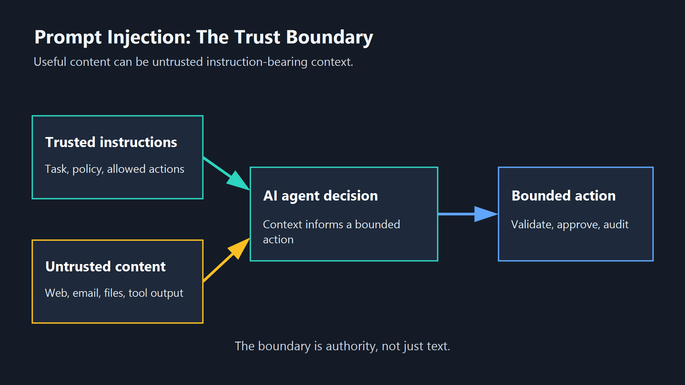
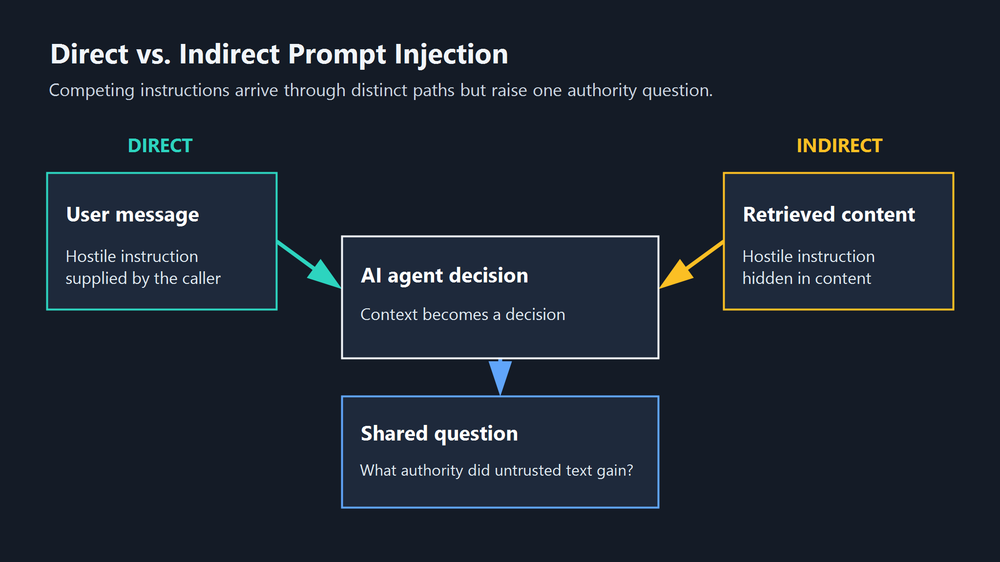
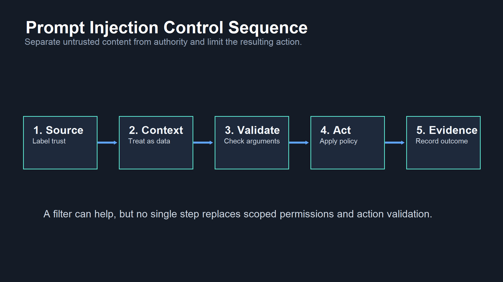

<!--
Source: https://acntglrfp7bm.feishu.cn/wiki/LK0OwrbhsiKfW3k2JBIcuytHnpd
Feishu document id: V6aWdcncLoC2hsxoHjucW41inxb
Revision: 28
Exported at: 2026-08-15T13:31:06Z
-->
<title>What is Prompt Injection &amp; How it Works</title>

Title: What is Prompt Injection & How it Works

SEO Title: What is Prompt Injection & How it Works | AgentGuard

status: draft

noindex: true

Author: [Author pending approval]

Category: Glossary

Route: /glossary/prompt-injection/

Canonical: [https://www.agentguard.one/glossary/prompt-injection/](https://www.agentguard.one/glossary/prompt-injection/)

# What is Prompt Injection & How it Works

**Prompt injection** is an attempt to make an AI model follow untrusted instructions instead of the task, rules, or constraints that were meant to govern it. The attacker does not need to break into the model. They need text that the model treats as relevant context when deciding what to say or do.

TL;DR: Direct prompt injection comes from a user message; indirect prompt injection arrives through content the model reads, such as a web page, document, email, tool description, or retrieved record. Both can steer a model, but neither is identical to every jailbreak, malicious tool, or unsafe action.

## 1. The definition: instructions hidden inside input

An LLM does not naturally separate an instruction from a fact just because a person would. Its behavior is shaped by the full context it receives: system instructions, a user request, conversation history, retrieved text, files, tool outputs, and tool metadata. Prompt injection happens when untrusted text is written to compete with or override the instructions that should control the task.

The result can be small, such as a model ignoring a formatting rule. It can also be serious when an agent has tools, data access, or authority to act. A successful injection may try to expose confidential context, make an agent call an unintended tool, alter a workflow, or persuade a reviewer that a risky request is safe.

OWASP lists prompt injection as an LLM application risk because manipulated input can change model behavior and can include attempts to bypass safety measures. Its guidance is useful here because it treats the problem as a context and control issue, not merely as a bad string to filter. See [OWASP's prompt injection risk entry](https://genai.owasp.org/llmrisk/llm01-prompt-injection/) for its current taxonomy and mitigation guidance.

The phrase "ignore previous instructions" is a familiar example, but the wording is not the defining feature. An injection can be subtle, task-specific, or written as a plausible instruction inside ordinary content. The important question is whether text from an untrusted source changes the model's reasoning or action path.

## 2. Direct and indirect prompt injection are different delivery paths

### Direct prompt injection

Direct prompt injection is supplied straight to the model by the user or caller. A user may ask an assistant to disregard its policy, reveal hidden instructions, or take an action that lies outside the intended request. This includes many jailbreak attempts, but the two labels are not interchangeable: a jailbreak usually describes an attempt to bypass a model's constraints, while prompt injection describes the mechanism of competing instructions in the model context.

Direct attacks are easier to see because the hostile instruction is in the visible request. That does not make them trivial to handle. A model can still be confused by language that mixes a legitimate goal with a conflicting command, especially when an application gives the model broad tools or poorly scoped action authority.

The practical test is not whether a sentence sounds aggressive. It is whether the application gives the sentence a route to influence a protected decision. A support assistant that can only answer from a public knowledge base has a smaller consequence boundary than an agent that can search internal records, draft external messages, or change a production setting. The same direct instruction can therefore have very different risk depending on the permissions, approvals, and validation around the model.

### Indirect prompt injection

Indirect prompt injection arrives through content the model processes on someone else's behalf. An agent may browse a web page, summarize a document, read an email, query a knowledge base, consume a tool result, or inspect an MCP server description. The content can include text intended for the model rather than the human reader: for example, a hidden request to exfiltrate data, change a summary, or call a particular endpoint.

This path matters for agents because the user may never see the hostile text. The user asked for a benign task, while the agent encountered untrusted instructions during retrieval or tool use. Indirect injection is therefore a trust-boundary problem: data that is useful as reference material must not automatically gain the authority to direct the workflow.

This is why an application should preserve the separation in its own orchestration. Retrieved content can be quoted, summarized, or used as evidence, while the task definition and action policy remain outside that content. If the model proposes an action after reading a source, the application can check the destination, arguments, and scope with ordinary software controls before anything irreversible happens. That does not remove the need to investigate an injection attempt, but it reduces the chance that a single manipulated passage becomes an unchecked operational command.

## 3. What prompt injection is not

Prompt injection is related to several other risks, but combining them makes incident response less precise.

| Risk | What changes | Why it is not automatically prompt injection |
|-|-|-|
| Jailbreak | A user tries to bypass a model constraint. | It is often a direct injection attempt, but can also be a broader behavior-evasion request. |
| Tool poisoning | A tool description, result, or metadata is malicious or deceptive. | It can carry an indirect injection, but the tool itself may also be compromised. |
| Compromised server | A service returns altered data or executes malicious behavior. | The failure may be code, identity, transport, or integrity, even without model-directed text. |
| Unsafe tool action | The agent acts outside approved policy. | An injection can trigger it, but missing authorization or validation can be the separate root cause. |

That distinction changes the control choice. If an agent is about to trust a skill, plugin, agent, or MCP server, the artifact and its metadata should be reviewed before use. AgentGuard documents [Deep Scan](https://www.agentguard.one/features/deep-scan) for these component types and names prompt injection, malicious tools, credential leaks, and backdoors as scan categories. That is a useful pre-use check, not a claim that every hostile instruction or component will be found.

Do not turn every odd model response into a prompt-injection incident. Check whether untrusted instructions entered the context, whether the model followed them, which tool or data boundary existed, and whether a separate authorization or integrity failure made the outcome possible.

## 4. Reduce exposure by controlling context and actions

Prompt injection cannot be handled by a single prompt template. The practical goal is to limit which content can influence a model, what the model is allowed to do after reading it, and what evidence is retained when it does act.

Start by labeling sources. System instructions, user intent, retrieved data, and tool output should not receive the same authority. Treat retrieved web pages, email, documents, and third-party tool metadata as untrusted content even when they are useful. Preserve their source and version so a suspicious instruction can be traced back to its origin.

Teams should also decide what the model is never allowed to infer from content alone. A retrieved page should not be able to authorize a data export, choose a new recipient, weaken an approval rule, or silently add a tool. These decisions need an explicit policy path owned by the application. For agent workflows, the design question is concrete: after the model reads this source, which proposed actions can still occur without a human or deterministic validation step?

Next, reduce the consequences of a confused model. Scope tools to the task, require explicit approval for sensitive writes or external communication, validate parameters outside the model, and prevent retrieved content from selecting privileged destinations. The NIST AI Risk Management Framework does not prescribe an LLM-specific filter, but its [risk-management guidance](https://www.nist.gov/itl/ai-risk-management-framework) supports assigning controls, measuring results, and retaining evidence instead of treating a one-time check as a complete solution.

This evidence-first approach also makes investigations less speculative. A team can compare the source content, the context passed to the model, the proposed action, and the final policy decision instead of trying to infer a cause only from the agent's final message.

When an agent is about to act, an action-time policy layer is different from a content scan. AgentGuard documents [Runtime Guard](https://www.agentguard.one/features/runtime-guard) as evaluating named high-risk categories before execution, including tool actions, file access, network requests, secret access, sensitive writes, and webhook exfiltration. The documented boundary matters: action evaluation does not prove the model never saw an injection, and public material does not support a claim that every third-party MCP runtime call is monitored or blocked.

Use this compact control sequence:

1. Identify the source and label untrusted content before it enters model context.
2. Keep untrusted text as data for the task, not as authority to change rules or select privileged actions.
3. Validate tool arguments and destinations outside the model.
4. Require approval for high-impact actions and constrain credentials to the smallest useful scope.
5. Log the source, decision, action, and outcome so a failure can be investigated.

### One CTA

If your agent reads untrusted content and can use production tools, [discuss a bounded prompt-injection control design with AgentGuard](https://www.agentguard.one/contact) before expanding its permissions.

## 5. FAQ

### Can a prompt injection succeed if the user did nothing malicious?

Yes. Indirect prompt injection can come from content an agent retrieves or reads while carrying out a normal user request. The user may not know that a page, document, email, or tool description contains model-directed text.

### Is filtering phrases like "ignore previous instructions" enough?

No. It can catch obvious examples, but attackers can vary wording and hide instructions in context that looks relevant to the task. The stronger control is to reduce the authority of untrusted content, validate actions outside the model, and limit what an agent can do.

### Where should an implementation team start?

Start with the agent's inputs and permissions: list what it can retrieve, which tools it can call, which actions need approval, and what evidence is logged. The [AgentGuard documentation](https://www.agentguard.one/docs) is an implementation reference; verify the production route and the specific integration coverage before relying on it for a deployment.

Prompt injection is not a reason to avoid useful AI workflows. It is a reason to separate untrusted content from decision authority, constrain actions that follow model output, and keep enough evidence to investigate when a workflow behaves unexpectedly.