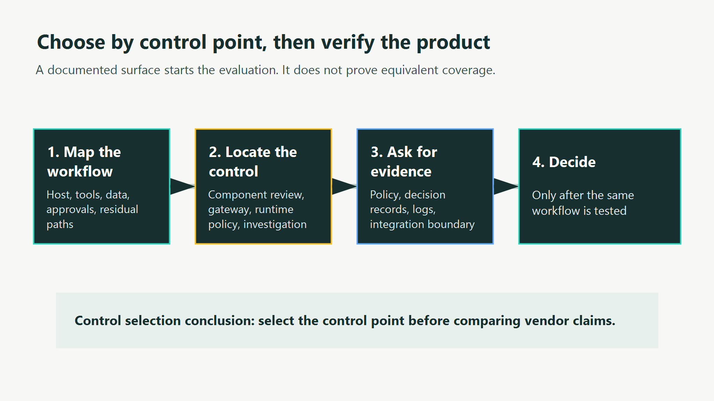
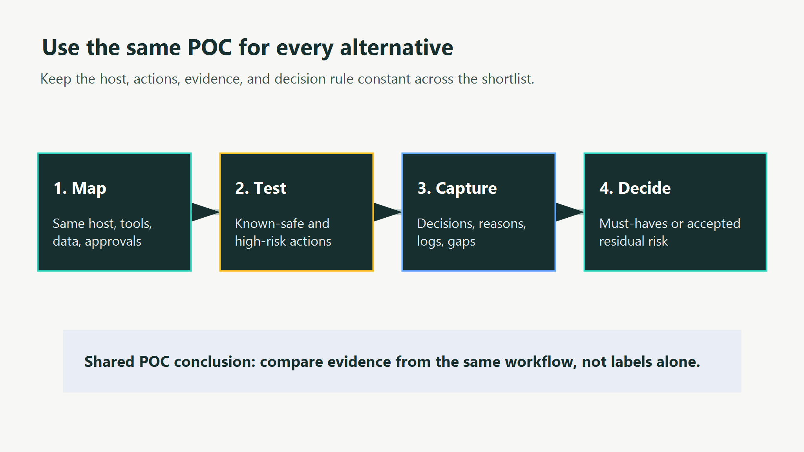

<!--
Source: https://acntglrfp7bm.feishu.cn/wiki/XBjvw8wV8iUZANkQEBDcrt84n1e
Feishu document id: SP4YdDxQGoMfYaxUqnccQwI3nyd
Revision: 14
Exported at: 2026-08-15T13:31:06Z
-->
# Choosing a Zenity Alternative for AI Agent Security

SEO Title: Zenity Alternatives for AI Agent Security | AgentGuard  
Category: Compare  
Route: /compare/zenity-alternatives/  
Canonical: [https://www.agentguard.one/compare/zenity-alternatives/](https://www.agentguard.one/compare/zenity-alternatives/)  
Status: Draft  
Author: [Author pending approval]  
Robots: noindex  
Vendor-authored comparison: AgentGuard publishes this page and appears in the shortlist. It is not an independent review.

Zenity may be in the conversation because its platform is positioned around securing enterprise AI, low-code, and agentic applications. An alternative only makes sense when the buyer can name the workflow, control point, evidence, and residual risk they need.

TL;DR: Compare Zenity alternatives by the path they can observe or control in your own agent workflow, then run the same POC for every product. Public marketing pages do not prove equivalent coverage, performance, or fit.

## 1. Start with the decision, not a feature list

An agent-security purchase usually fails when teams compare labels such as "AI security" or "runtime protection" as though they describe the same implementation. They do not. One product may inspect components before deployment; another may sit at a gateway; another may evaluate an action before it executes.

Use the [NIST AI Risk Management Framework](https://www.nist.gov/itl/ai-risk-management-framework) as a reminder to document the context, measure the risk, and govern the decision. It does not select a vendor for you, but it gives the POC a discipline that a feature checklist lacks.

For this query, five fields matter more than a score: the protected workflow, where a control enters it, how the product integrates, what evidence an operator can retrieve, and which paths remain unknown.

| Decision field | What to ask in a POC |
|-|-|
| Protected workflow | Which agent host, tools, data classes, and actions are in scope? |
| Control point | Is the product reviewing code, governing a gateway, evaluating runtime actions, or investigating events? |
| Integration | What must be installed, routed, configured, or approved? |
| Evidence | Can the team retrieve a decision, reason, policy context, and audit trail? |
| Boundary | Which routes are indirect, unsupported, or simply undocumented? |

CTA: [Map your agent control points with AgentGuard](https://www.agentguard.one/).

## 2. What public evidence establishes about Zenity

Zenity's public site positions the company around security for enterprise AI, low-code, and agentic applications. That is useful starting evidence, not a complete technical audit. This article does not infer Zenity's price, deployment architecture, data handling, latency, detection rate, or coverage limits where the reviewed public pages do not establish them.

That distinction matters. Missing public detail can mean the material is not on the page, not that the capability is absent. Treat it as a question for the vendor and make the answer part of the POC record.

## 3. Shortlist alternatives by control point

### AgentGuard: documented runtime governance for supported integrations

AgentGuard publicly describes runtime governance that intercepts tool calls, model outputs, and spend before execution in supported integrations. It also lists adapters or integration support for OpenClaw, LangChain, CrewAI, OpenAI Assistants, AutoGen, LangGraph, MCP, Express, and FastAPI. That gives a team a concrete route to test when its priority is policy-governed agent behavior rather than a broad vendor category.

Read the [AgentGuard runtime documentation](https://www.agentguard.one/docs) before assuming a named adapter gives every host the same depth. The real boundary is what the target integration exposes for evaluation and what the team can demonstrate in its workflow.

The public policy examples cover tool allowlists, spend caps, PII egress, approval gates, and time rules. Those are documented product surfaces, not proof that AgentGuard is a universal answer for every agent architecture or all third-party MCP runtime paths.

### Gateway-oriented alternatives: choose when traffic centralization is the requirement

Some buyers need a place to authenticate, route, inspect, or apply policy to traffic moving through a defined intermediary. A gateway-oriented product can be a better starting point when that route already exists and the organization can enforce that path.

The trade-off is structural, not a product defect: traffic that does not pass through the selected control point needs a separately tested answer. Ask vendors to draw the real request and tool-call path rather than accepting a generic architecture slide.

### Component and posture alternatives: choose when inventory comes first

Other products concentrate on discovering AI assets, reviewing packages or configurations, and helping teams understand their exposure before a runtime enforcement project begins. This can fit a program that first needs an inventory, component review, or a prioritized remediation backlog.

That is a different job from deciding a high-risk action at runtime. The buyer should not score those categories against each other until the protected workflow has been fixed.

### Application-security alternatives: choose when the primary asset is the application

An application-focused offering can fit when the main concern is a known AI application, its data flows, and its policy obligations. It may be the right control boundary for a team whose agents operate within one governed application estate.

The question to test is whether the actual agent tools, external actions, and operator evidence are visible at that application boundary. A familiar product category does not answer that automatically.

For a supported agent-host evaluation, [AgentGuard's documented integration surface](https://www.agentguard.one/) provides a concrete starting point for the runtime side of that test. It does not remove the need to map indirect tools, custom middleware, or third-party services in the real deployment.

| Shortlist type | Best starting condition | Evidence to request | Common unresolved question |
|-|-|-|-|
| AgentGuard | Supported agent integration and pre-execution policy need | Action decision, policy, approval and audit evidence | Host-specific coverage depth |
| Gateway-oriented | All relevant traffic can use a defined intermediary | Route map, policy result and event record | Bypass and indirect paths |
| Component/posture | Inventory and pre-deployment review are the immediate need | Finding, source, remediation workflow | Runtime enforcement scope |
| Application-focused | A bounded AI application is the primary asset | Application path, data boundary and policy evidence | Tool/action visibility |

AgentGuard also exposes an [AgentGuard API reference](https://www.agentguard.one/docs/api) for documented action evaluation and related integration work. Use that as a source for what can be tried, not as a proxy for a completed test.

## 4. Make evidence a selection requirement

Security controls produce value only when an operator can explain what happened and what to do next. A screenshot that says an event was "blocked" is not enough evidence for a production decision. The POC should show the action or input, the policy or rule that applied, the decision, a reason the team can understand, and the record that remains after the test.

This is where superficially similar platforms diverge. One may record a gateway event but have no view of the agent's internal choice. Another may identify a component risk but not decide a live tool call. A runtime control may produce a decision record but only for the actions that its integration exposes. None of those facts are inherently good or bad; they establish whether the control matches the operating model.

Require the same evidence fields from every vendor. Capture the policy identifier, the actor or agent identity, the relevant request or tool name, the decision, the reason, the timestamp, and the remediation or approval path. For data-sensitive workflows, record what test input was transmitted, redacted, stored, or left local. These details turn a vendor conversation into a traceable design choice.

Do not accept a generic assurance that the platform "covers agents." Ask whether the sample record can be produced from your own agent host, tools, data classification, and approval configuration. A product may still be viable when an answer is not yet available, but the gap should have an owner and a date for verification.

## 5. Use the same proof of concept

The POC needs one workflow, one environment, the same safe and high-risk cases, and the same evidence requirements. Otherwise a polished demo from one vendor becomes a comparison against a different problem.

For the high-risk case, use a scenario relevant to the workflow, such as an agent receiving instruction-like content from an untrusted tool result. The [OWASP guidance on prompt injection](https://genai.owasp.org/llmrisk/llm01-prompt-injection/) helps define the threat, but the acceptance test must specify the expected control behavior in your own system.

| Step | Same input for each product | Evidence to retain |
|-|-|-|
| Map | Host, tools, users, data constraints, approval path | Architecture, setup steps, privileges, unsupported routes |
| Test | One known-safe action and one pre-defined high-risk action | Allow, block, flag, or approval result plus reason |
| Capture | One finding or decision | Policy context, actor, timestamp, record fields, investigation path |
| Decide | Same must-have outcomes | Confirmed outcomes, operating effort, exceptions, residual risk |

CTA: [Use AgentGuard to test a supported runtime integration](https://www.agentguard.one/).

## 6. Questions to take into the vendor call

Ask Zenity and every alternative where the control executes, what it observes before and after an action, what data leaves the environment, and what evidence remains for an investigation. Ask which integration paths are demonstrated rather than merely planned.

Then ask the harder question: what happens on a route the product does not see? A credible answer may be a documented limitation, a compensating control, or an accepted residual risk. Silence is not an answer.

Ask for a deployment sequence as well. Who installs the control, who can change policy, who approves exceptions, and who owns the log after an incident? A POC that works only with a vendor engineer present can still teach you something, but it does not establish daily operating effort.

Finally, set a stopping rule before the test starts. For example, the team may require a documented integration into one agent host, an understandable decision for a defined high-risk action, an operator-readable evidence record, and an explicit answer for every indirect route. If a product does not meet a must-have outcome, do not compensate with an invented score.

## Frequently asked questions

### Is this an independent comparison?

No. AgentGuard publishes this page and includes its own documented product surface. The page is designed to make that relationship and its evidence boundary visible.

### Does an unknown Zenity field mean Zenity lacks the capability?

No. It means the reviewed public sources did not establish that fact. Verify it directly with current technical documentation and the POC.

### Can a component scanner replace runtime governance?

Sometimes both are needed, but they answer different questions. A component review happens before or around deployment; a runtime control depends on the live integration path and action context.

### What should decide the final selection?

Choose the product that demonstrates the required outcomes in the target workflow, produces usable evidence, and leaves a residual risk the organization explicitly accepts. Do not choose from a generic score.

## Source boundary

AgentGuard sources: public product site and documentation, accessed 2026-08-03. Zenity source: public Zenity site, accessed 2026-08-03. Alternative-directory page titles were collected on the same date; their full bodies were not available to the collector because of access controls. Review all vendor material again before production deployment.