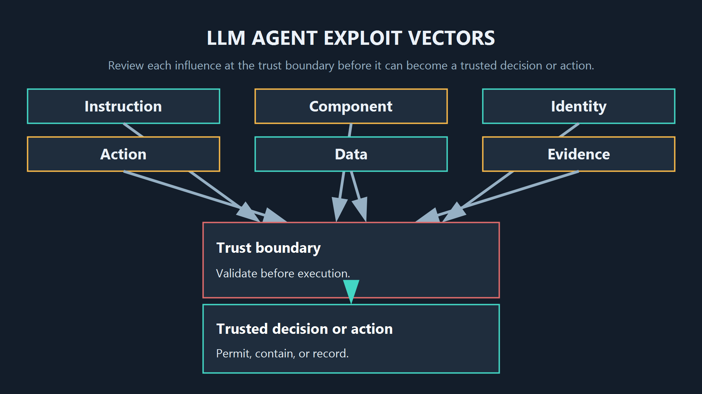
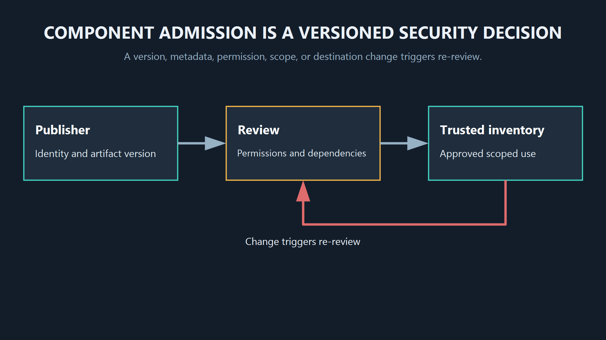
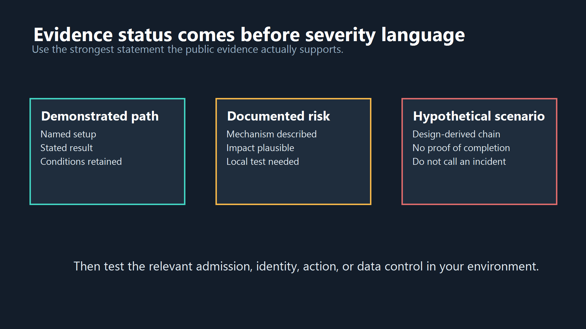
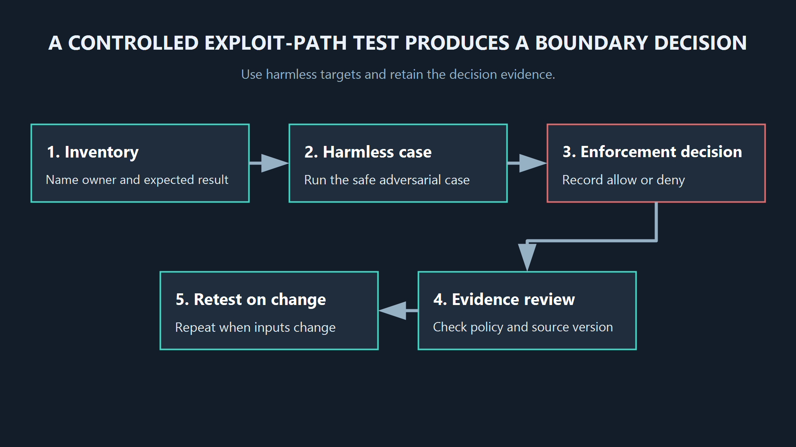

<!--
Source: https://acntglrfp7bm.feishu.cn/wiki/DYgewwDb8i65a1kkbSvcTRVfn1c
Feishu document id: PWhMd0R4iogFVLxRO2Dcgrpanqa
Revision: 25
Exported at: 2026-08-15T13:31:06Z
-->
# How LLM Agents Are Exploited: Attack Paths and Defenses

An LLM agent becomes a security problem when untrusted input can change a decision that reaches a tool, credential, data store, or external destination. The useful question is not which framework name applies. It is where that influence crosses a trust boundary.

title: How LLM Agents Are Exploited: Attack Paths and Defenses

seoTitle: LLM Agent Exploits: Attack Paths and Defenses | AgentGuard

description: Review LLM agent exploit vectors by the trust boundary they cross, separate demonstrated paths from documented risks, and map controls to their real limits.

slug: /review/llm-agent-exploit-vectors

canonical: https://www.agentguard.one/review/llm-agent-exploit-vectors/

category: Review

author: [Author pending approval]

status: draft

noindex: true

primaryKeyword: llm agent exploit vectors

> TL;DR: Review exploit vectors at the instruction, component, identity, action, data, and evidence boundaries. Mark what has been demonstrated, what is a documented risk, and what remains hypothetical before selecting a control.

Figure 1. An exploit path matters when influence reaches a trusted decision or action. The same prompt injection can have very different impact depending on the tools and permissions behind it.

## 1. What This Review Counts As An Exploit Vector

An exploit vector is a route through which an attacker-controlled instruction, component, identity, response, or state changes an agent decision and produces an unauthorized effect. The route may start with text, a document, a tool description, a plugin update, a stolen credential, or a compromised dependency. It ends only when the system rejects, contains, records, or executes the affected action.

This definition avoids a common mistake: treating every unsafe model response as an agent exploit. A bad answer is still a problem, but the severity changes when the answer is consumed by an autonomous loop that can read private data, send messages, write files, or invoke services.

This review uses three labels. A demonstrated exploit path has a public experiment, incident report, or reproducible technical account with stated conditions. A documented risk is described by an authoritative framework or vendor research but is not evidence that it has occurred in a particular environment. A hypothetical scenario is plausible from the design, yet lacks public proof for the claimed chain. Do not turn the latter two into breach statements.

The labels describe evidence, not urgency. A hypothetical path into a production payment tool can deserve an immediate design change. A demonstrated path against a laboratory application may have little relevance when a local deployment has no comparable tool or permission. Keep the two questions separate: how strong is the evidence, and what is the credible consequence for this workflow?

This also keeps framework mapping honest. OWASP, MITRE, vendor taxonomies, and internal issue labels are useful ways to catalogue work. They are not the control boundary themselves. A single indirect injection can map to several labels while still requiring one practical decision: whether a given tool call, data read, or outbound request should be allowed.

| Evidence label | What it establishes | What it does not establish |
|-|-|-|
| Demonstrated exploit path | A named setup produced a stated result under documented conditions | Prevalence or universal success in production |
| Documented risk | A source identifies a mechanism and its likely impact | That the mechanism bypasses your controls |
| Hypothetical scenario | A design review identifies a possible chain | That an attacker has used or can complete it |

## 2. The Instruction And Retrieval Boundary

Status: documented risk. Direct prompt injection comes from a user message. Indirect prompt injection arrives through content the agent retrieves or opens: a web page, ticket, email, document, issue, or tool result. The target is the decision process, not only the visible answer.

[OWASP's 2025 prompt injection guidance](https://genai.owasp.org/llmrisk/llm01-prompt-injection/) identifies direct and indirect paths and notes that instruction hierarchy alone cannot guarantee protection. That is why a system prompt saying "ignore untrusted instructions" is not a control plan for a tool-enabled workflow.

The test is concrete. Place a benign but policy-violating instruction in a document that the agent is authorized to summarize. Observe whether the agent treats it as data, whether it proposes a prohibited tool call, and whether a separate control stops the call. Do this in an isolated environment with harmless destinations.

The boundary gets wider when retrieval can write long-term memory. A malicious page that changes one task may be contained by a fresh session. A page that causes an agent to store a poisoned preference or instruction can influence later tasks and other users if memory isolation is weak.

## 3. The Component Admission Boundary

Status: documented risk, with some mechanisms demonstrated in security research and tooling. Skills, plugins, packages, MCP servers, tool descriptions, and agent templates are executable or decision-shaping dependencies. Their names and metadata can influence selection before their code runs.

A poisoned component can ask for excessive permissions, hide a harmful instruction in a description, add an outbound destination, or change behavior in an update. The agent may then call it through a path that looked trusted during an earlier review. This is a supply-chain route, not merely a model-safety failure.

Tool descriptions deserve the same review as implementation. In many agent hosts, a description tells the model when to select a tool and how to format arguments. An attacker who cannot change code may still influence selection through a changed description, an attractive tool name, or a malicious capability claim. Pinning a package version without recording its tool metadata leaves that decision surface unreviewed.

The admission test should include a benign replacement artifact. Change one permission, one endpoint, or one tool description in a staging copy, then determine whether the inventory detects the difference and whether the route is held for review. A scan result with no version, no source, and no decision owner is evidence of a check, not evidence of trust.

Review the artifact before it joins the trusted set. That means recording publisher, version, permissions, dependencies, declared tools, endpoints, and the specific content that was assessed. A later change to code, metadata, tool description, scope, or endpoint should reopen that decision.

For teams reviewing this boundary, [Deep Scan](https://www.agentguard.one/features/deep-scan) is publicly described by AgentGuard for skills, plugins, MCP servers, agents, and related components, including checks for prompt injection, malicious tools, credential leaks, and backdoors. That is documented component coverage, not proof that every poisoned component will be found or that it controls later third-party runtime calls.

Figure 2. Component trust is a versioned decision. A changed artifact, description, permission, or destination reopens review.

## 4. The Agent Identity And Delegation Boundary

Status: documented risk. An agent identity can be a service account, API token, browser session, OAuth grant, local credential, or delegated user authority. Exploitation occurs when the agent receives more authority than the task needs, or when a downstream tool cannot tell which agent and user initiated the action.

Prompt injection becomes more serious here because the agent may be able to act with a durable credential. The control question is not whether the model can be persuaded. It is whether the resulting action has a scoped identity, an expiry, a target allowlist, and an approval step proportionate to its impact.

Delegation creates another edge. Agent A can ask Agent B to perform work with a different permission set. If the request loses its origin, purpose, or policy context, B may treat a constrained request as a broadly authorized one. This is a documented architectural risk; an organization should test its actual delegation protocol before claiming a bypass exists.

Do not pass raw natural-language requests as the only delegation contract. A downstream worker should receive a task identifier, explicit allowed operations, resource scope, initiator, expiry, and the approval state needed for any escalation. Its response should carry those fields forward. This lets the final action policy distinguish "summarize this record" from "send this record to a new destination," even when both requests arrive through the same agent.

Credential handling creates a quieter failure mode. A secret in a tool environment may be safe from the model text but still over-broad for the action it authorizes. Test whether a failed task, retry, error message, trace, browser session, or child process exposes the credential or extends its scope. Short-lived, task-scoped grants reduce the impact of both manipulation and accidental disclosure.

Useful evidence includes the caller identity, initiating user, task identifier, tool scope, approval state, policy version, and expiry. Without those fields, post-incident reconstruction becomes guesswork even when the action log exists.

## 5. The Tool And Action Execution Boundary

Status: demonstrated exploit path in published research under stated setups; documented risk in deployed agent systems. A tool call converts the agent's interpretation into an operation on the world: a shell command, file write, API request, database query, browser action, message, payment, or webhook.

The research paper [The Dark Side of LLMs](https://arxiv.org/html/2507.06850v3) evaluates agent-based attack setups and reports complete-computer-takeover outcomes in its synthetic applications. Read that result narrowly. It supports the paper's threat model and test conditions. It does not prove that any production coding agent can be taken over, nor that a particular defensive product stops the path.

The action boundary is where independent enforcement has the clearest job. Check the full request context, caller identity, target, arguments, sensitivity, destination, and prior approval. Then decide allow, deny, require approval, or limit the operation. A model-side refusal is useful but cannot substitute for an action policy when the system can execute.

[Runtime Guard](https://www.agentguard.one/features/runtime-guard) is publicly described by AgentGuard as evaluating shell commands, file access, tool actions, network requests, secret access, sensitive writes, and webhook exfiltration before execution. Its public FAQ also says it cannot fully monitor or block all third-party MCP server runtime calls. Keep that unsupported path in the threat model rather than writing a blanket prevention claim.

Use a harmless denied-action case first, and record the integration mode and the policy decision before raising permissions.

> Evaluate a high-risk action in the supported agent path before it executes. [Open Runtime Guard](https://www.agentguard.one/)

## 6. The Data, Memory, And Outbound Boundary

Status: documented risk. Agents often combine retrieved context, session state, long-term memory, local files, SaaS records, and output channels. A route becomes high impact when a manipulated decision reads sensitive data or sends it to an untrusted destination.

Separate read authority from send authority. An agent may need to summarize a customer record but should not automatically attach it to a ticket, paste it into a third-party chat, or call an arbitrary webhook. Destination controls and content handling rules belong on the outbound action, not only on the initial retrieval.

Classify destinations before an incident forces the question. A known internal case-management endpoint, an approved customer domain, a local filesystem path, and a newly supplied webhook should not receive the same default treatment. For each class, decide whether the agent can send automatically, needs user confirmation, requires a second service identity, or must be denied. Log the resolved destination, not only the command name.

Data minimization matters in investigation too. The evidence needed to reconstruct a decision can include a request hash, source identifier, policy result, and redacted argument summary rather than full prompts or file contents. Decide who can read that evidence, how long it stays available, and how a subject can request removal. A useful audit trail should not create a second uncontrolled data store.

Memory needs its own test. Identify who can write each memory store, whether one tenant can influence another, how long an entry survives, whether a person can inspect and remove it, and whether stored tool output is ever reinterpreted as an instruction. A hypothetical cross-session poisoning chain becomes a demonstrated local issue only after a controlled test shows persistence and reuse.

| Boundary | Review question | Failure signal |
|-|-|-|
| Retrieval | Which source can shape context? | Untrusted text changes an action proposal |
| Memory | Who writes and reuses state? | A prior task changes a later decision |
| Data access | Which fields can the agent read? | A low-risk task exposes unrelated records |
| Outbound action | Which destinations can receive data? | A new or unapproved destination is allowed |

Figure 3. Labeling the evidence prevents a plausible scenario from being presented as an incident.

## 7. How To Review And Test The Paths

Start with an inventory of agent, model, instructions, tools, components, identities, data sources, memories, outbound destinations, and owners. Map the sequence from incoming content to action. The [AI agent security guide](https://www.agentguard.one/guides/ai-agent-security) can help turn that inventory into a broader implementation plan, but the test cases must fit the actual workflow.

For each high-impact tool, create a harmless adversarial case. Use a fake secret, a test mailbox, a disposable file, or a sink endpoint. Record the expected result, the tool call the agent proposes, the policy decision, the retained evidence, and the behavior if a control is unavailable. Test changed tool descriptions and newly added components separately from prompt injection.

Run the cases at each meaningful transition, not only at the final action. One case can test an injected instruction in retrieved content. Another can test a modified MCP tool description. A third can request an otherwise allowed action against a newly introduced destination. This shows whether the system fails at interpretation, admission, identity propagation, runtime enforcement, or logging. Combining them into a dramatic all-in-one test makes the result harder to diagnose.

Define pass criteria before running the test. For example: the agent may read the benign document, but it must not send a message to the sink endpoint; the policy layer must produce deny or approval; the log must include the initiating task and policy version; and an operator must be able to locate the result. An unexpected allow is a defect. A deny without sufficient evidence is an operational gap.

Retest after changes that alter the path: a model upgrade, tool addition, new plugin, permissions change, prompt or policy revision, memory migration, delegation change, or new output integration. This is why agent security is a continuing configuration-review job. The goal is not to certify an abstract agent as safe. The goal is to know which concrete routes are controlled today and which routes still need an owner.

Assign a named owner to every unresolved route. The owner may accept a temporary limitation, remove the integration, reduce its scope, or schedule a control change. What matters is that the exception stays visible when the workflow evolves. An unowned gap is not a risk register entry; it is an untested execution path.

The result should make a boundary decision visible. If a model proposes an unsafe action and the action control denies it, the test demonstrates a working enforcement point. If an unreviewed component is admitted, the failure sits at admission even if later runtime controls prevent damage. A single pass does not prove the whole chain is safe.

Figure 4. A useful test names the boundary, expected decision, retained evidence, and the condition that requires retesting.

> Turn the review into a component and action test plan. [Start with AgentGuard](https://www.agentguard.one/)

## FAQ

### Is prompt injection the same as an LLM agent exploit?

No. Prompt injection is one influence mechanism. It becomes an agent exploit path when that influence crosses into a trusted decision and leads to unauthorized data access, tool use, delegation, or an outbound action.

### Does a demonstrated research attack prove a production breach risk?

It proves the outcome under the paper's stated conditions. It should trigger a local threat-model and control test, not an assertion that every agent or deployment has the same exposure.

### Can component scanning replace runtime controls?

No. Component review decides whether an artifact should enter the environment. Runtime controls decide whether an observable action should execute. A changed component or an unmediated action can bypass the other boundary.

### What should be tested first?

Test the tool with the highest plausible impact and the least visible decision path. Use harmless targets, confirm the expected allow or deny behavior, and retain enough evidence to explain the result.