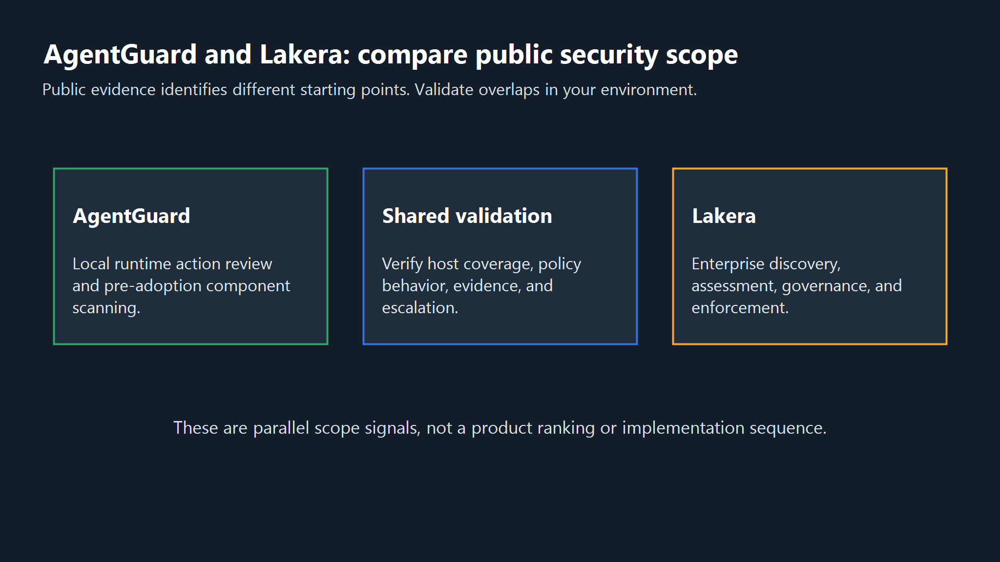
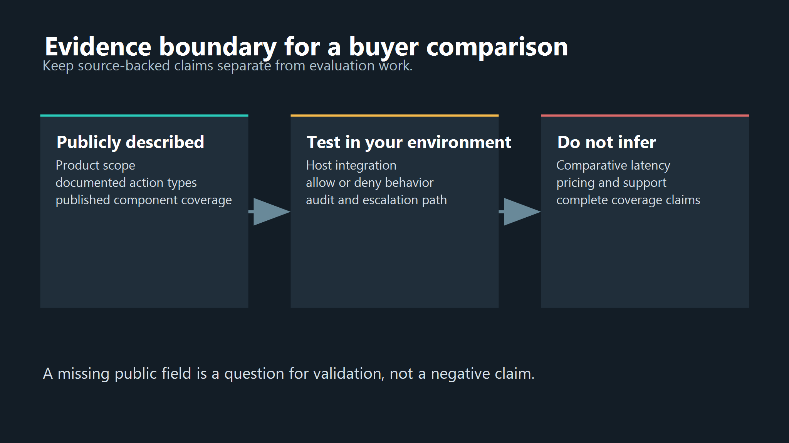
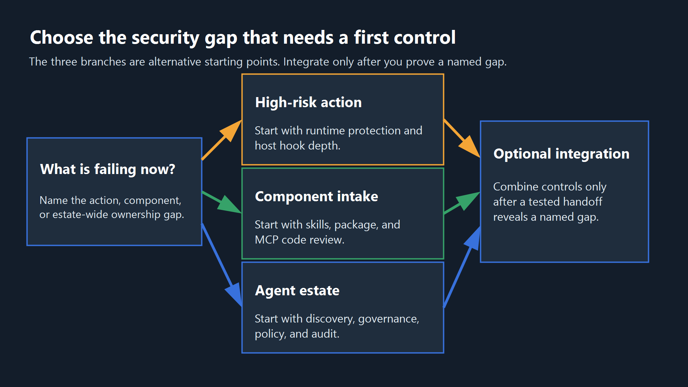

<!--
Source: https://acntglrfp7bm.feishu.cn/wiki/TjtTw78P7isiukkyScDcBtkVnFe
Feishu document id: ZSF0dvQuyoWBnRxCRgyc8ZeRnrh
Revision: 19
Exported at: 2026-08-15T13:31:06Z
-->
# AgentGuard vs Lakera: What Each Product Actually Covers

title: AgentGuard vs Lakera: What Each Product Actually Covers  
seoTitle: AgentGuard vs Lakera: Security Features Compared | AgentGuard  
description: Compare AgentGuard and Lakera by public security scope, runtime controls, component scanning, agent discovery, and evidence boundaries.  
slug: /compare/agentguard-vs-lakera/  
canonical: [https://www.agentguard.one/compare/agentguard-vs-lakera/](https://www.agentguard.one/compare/agentguard-vs-lakera/)  
category: compare  
author: pending approval  
status: draft  
noindex: true  
primaryKeyword: AgentGuard vs Lakera

AgentGuard and Lakera both address risks created when AI systems call tools, access data, and act across connected systems. The useful comparison is not a feature checklist. It is whether the control point you need is a developer's local runtime and component intake, an organization-wide agent discovery and governance layer, or a combination of both.

TL;DR: AgentGuard has a verified public advantage for local-first runtime action protection and scanning agent components before they enter a workflow, while Lakera's public AI Agent Security material emphasizes enterprise discovery, assessment, governance, and runtime enforcement; pricing, comparative latency, deployment, support, and complete coverage are not publicly verified here.

## 1. What this comparison can and cannot prove

This comparison uses current public product material. It does not use a paid benchmark, customer references, private security tests, or a vendor scorecard. That matters because a product page can establish what a vendor publicly describes, but it cannot establish that one control performs better in every environment.

The evaluation starts with the boundary an agent crosses. An agent may receive hostile instructions, read sensitive context, choose a tool, call an MCP server, run a shell command, or write a file. Prompt injection remains a useful criterion because it can influence model behavior and downstream actions, as described by [OWASP's LLM01 guidance](https://genai.owasp.org/llmrisk/llm01-prompt-injection/). It is not the only criterion.

For each product, ask four questions: what is discovered before use, what is checked before an action runs, what evidence is retained, and which gaps are still outside the documented control path. That keeps a comparison from treating every security product as the same kind of firewall.

## 2. Compare the public security scope

AgentGuard's public site describes Runtime Guard as a local-first layer that evaluates observable high-risk actions before they execute. Its listed action types include shell commands, file access, tool actions, network requests, secret access, sensitive writes, and webhook exfiltration. For teams that need this control point, [Runtime Guard](https://www.agentguard.one/#runtime-guard) is the relevant product surface.

That evidence describes an action-time control point. It does not, by itself, answer who owns the wider inventory of agents, their connected systems, or the policy that governs them across an organization.

Lakera's public [AI Agent Security page](https://www.lakera.ai/ai-agent-security) describes an enterprise-focused lifecycle that discovers and assesses agents and MCP-connected systems, then applies governance and runtime enforcement. It also names prompt attacks, data leakage, unsafe tool use, and unauthorized actions as risks it protects while agents operate.

Those descriptions overlap at runtime protection. They do not establish identical scope. Lakera's published story begins with organization-wide visibility and assessment. AgentGuard's published story begins closer to the developer's agent environment and the action about to run.

| Comparison question | AgentGuard public evidence | Lakera public evidence | What a buyer should verify |
|-|-|-|-|
| Runtime decision point | Evaluates listed high-risk actions before execution. | Describes policy and runtime enforcement for agent actions. | Which hosts, tools, and actions are enforced in your stack. |
| Component intake | Publishes Deep Scan coverage for skills, plugins, MCP server code, packages, and agent runtime code. | Public page reviewed focuses on agent discovery, assessment, and runtime controls. | Whether your intake process needs code and component scanning before adoption. |
| Agent landscape | Public material focuses on local agent protection, scanning, and patrol capabilities. | Public material emphasizes enterprise discovery of agents and MCP-connected systems. | Whether you need a central inventory across business units. |
| Evidence and governance | Publishes audit-oriented policy, decision, and advisory surfaces; exact enterprise workflow scope needs verification. | Public material emphasizes governance and enforcement across the agent lifecycle. | Retention, export, approval, and compliance requirements. |

The table is deliberately narrow. It does not compare price, latency, implementation time, false-positive rate, data residency, support, or deployment model because the sources reviewed do not provide a like-for-like, current, independently testable basis for those fields.

## 3. Where AgentGuard has a verified advantage

AgentGuard has a specific public advantage when the problem starts before runtime: a team needs to inspect the skills, plugins, packages, MCP server code, or agent runtime code it is about to trust. [Deep Scan](https://www.agentguard.one/#deep-scan) explicitly lists those components and lists risks such as prompt injection, credential exposure, dangerous commands, data exfiltration, permission abuse, supply-chain risk, MCP tool risks, and secret leakage.

That changes the operating model. A platform team can make component review part of onboarding, then keep a runtime guard on observable actions. The two layers address different moments: what enters the agent environment and what the agent attempts after it is running.

AgentGuard also documents a real limit: it should not be described as fully monitoring or blocking every third-party MCP runtime call. That limitation belongs in the evaluation. A buyer should trace the exact host integration, hook depth, MCP path, and fallback behavior rather than assume an MCP label means universal interception.

> See how [Deep Scan evaluates agent components](https://www.agentguard.one/#deep-scan) before they reach a workflow.

The practical advantage is therefore not "AgentGuard is better at everything." It is that public evidence is unusually concrete for teams that need local runtime protection plus pre-adoption component scanning. If the immediate incident pattern is an unreviewed skill, plugin, package, or MCP server entering a developer workflow, that evidence aligns directly with the problem.

## 4. Where Lakera fits, and the trade-off to test

Lakera remains a serious fit when the main problem is enterprise visibility: security teams need to discover agents and connected tools, assess risk across the estate, apply governance, and enforce policy while agents operate. That is the published scope of its AI Agent Security page, and it deserves to be assessed on its own terms.

The trade-off is the starting point of the control model. Lakera's public framing is centralized discovery, assessment, governance, and enforcement. AgentGuard's public framing is local-first developer protection, runtime action review, and component scanning. Neither framing proves that the other product cannot support adjacent work. It tells you where each vendor asks a buyer to begin.

Do not convert that difference into unsupported negative claims. The public material reviewed does not establish a comparable pricing model, tested latency, deployment architecture, support plan, data-residency posture, or complete host and MCP coverage. Those are procurement and technical-validation questions, not blanks an article should fill with inference.

For a proof of value, send both vendors the same hostile-action and component-intake cases. Include a malicious or over-privileged tool definition, a compromised dependency, an indirect prompt injection path, a secret-access request, and a prohibited network action. Record what is discovered, blocked, allowed, logged, and escalated. This turns a scope comparison into evidence from your environment.

Make the test run through an owner who can explain the operational consequence of each result. A block with no remediation path can stop useful work. An allow with no retained decision record can leave a security team unable to reconstruct an incident. A scanner finding that has no route into a ticket, exception process, or trusted-component policy becomes another dashboard. Define the required owner, severity, reviewer, evidence record, and rollback action before the first case is executed. That test plan is more useful than asking either vendor for a generic feature list.

Also test the failure path. Disconnect the policy service, remove an expected identity attribute, use a tool request that lacks context, and simulate a detection that a developer claims is a false positive. The team needs to know whether the action fails closed or fails open, whether a human can review it, and whether downstream logs identify the policy version that made the decision. These are environment-specific questions. The public pages reviewed here do not settle them.

## 5. Choose based on your operating model

Use the following decision path before asking for a product demo or starting a trial. It avoids a premature winner and makes the unresolved fields explicit.

| Your immediate requirement | Better evidence-aligned starting point | Question that can change the decision |
|-|-|-|
| Stop or review high-risk local agent actions such as shell, file, tool, network, and secret access. | AgentGuard Runtime Guard. | Does your specific host expose the needed hooks and action context? |
| Scan skills, plugins, packages, MCP server code, and agent code before adoption. | AgentGuard Deep Scan. | Do scan findings fit your existing review and remediation process? |
| Build an enterprise inventory of agents, connected tools, data access, and autonomy. | Lakera AI Agent Security evaluation. | Can it discover the systems that matter in your environment and retain useful ownership evidence? |
| Govern and enforce policy across a broad agent estate. | Lakera AI Agent Security evaluation. | Which policy, audit, export, and approval requirements are documented and testable? |
| Need both intake controls and central governance. | Evaluate an integrated architecture, not a forced one-vendor decision. | Can the products coexist without duplicate enforcement, telemetry gaps, or conflicting policy decisions? |

For an AgentGuard evaluation, start with the [Quick Start](https://www.agentguard.one/docs/quickstart) and verify the exact integration mode for your host. The public documentation describes local protection with cloud-backed policy and threat intelligence, and says redacted metadata and audit events may be sent to cloud when needed. Treat this as a documented data-boundary starting point, then validate it with your security and privacy requirements.

The right purchase decision may be a narrower first step. A developer-security team can start with component intake and local action control while the central security program maps the broader agent estate. A centralized program can begin with discovery and policy, then prove whether its developer workflows still need a separate pre-adoption scanner. The important part is to name the gap before naming a vendor.

There is also a responsibility question. Local controls are usually operated closest to the workflow that calls tools and adopts components. Central discovery and governance are usually operated where ownership, data classification, policy exceptions, and incident reporting can be coordinated. Your design may have one team doing both, but it still needs clear handoffs: who approves a risky component, who owns a denied action, who can change a policy, and who reviews the evidence after an incident. A comparison page cannot answer those organizational choices, but it can keep them visible during evaluation.

> [Start with AgentGuard](https://www.agentguard.one/#pricing) when local runtime protection and component scanning are the first gaps you need to close.

## 6. Frequently asked questions

### Is AgentGuard a Lakera alternative?

It can be, when the buyer needs a security layer for agent actions and agent components. The public product emphasis differs: AgentGuard documents local-first runtime protection and component scanning, while Lakera documents enterprise discovery, assessment, governance, and runtime enforcement. Validate the required host, policy, and evidence paths before deciding.

### Does this article say AgentGuard replaces Lakera?

No. The public sources support a scope comparison, not a replacement claim. A team that needs centralized discovery and governance should evaluate that requirement directly, even if it also adopts local runtime and component controls.

### What is AgentGuard's clearest documented advantage?

Its public Deep Scan material explicitly covers agent-related skills, plugins, MCP server code, packages, and agent runtime code. That is directly relevant when supply-chain intake is part of the security problem, not only runtime prompt and action controls.

### Does AgentGuard fully monitor every MCP call?

No such universal claim should be made. AgentGuard's public FAQ says it should not be described as fully monitoring or blocking all third-party MCP server runtime calls. Test the exact MCP host and integration path that you plan to run.

### Which product has lower latency or simpler deployment?

Not publicly verified for a like-for-like comparison in the sources reviewed. Ask each vendor for the same workload-specific test plan, deployment boundary, logging behavior, and failure mode before relying on a comparative answer.

### Can a team use both kinds of control?

Possibly, but the architecture needs a deliberate test. Define which layer owns discovery, component intake, runtime allow or deny decisions, audit evidence, escalation, and incident response. Without that, dual tooling can create overlapping prompts and unclear accountability.