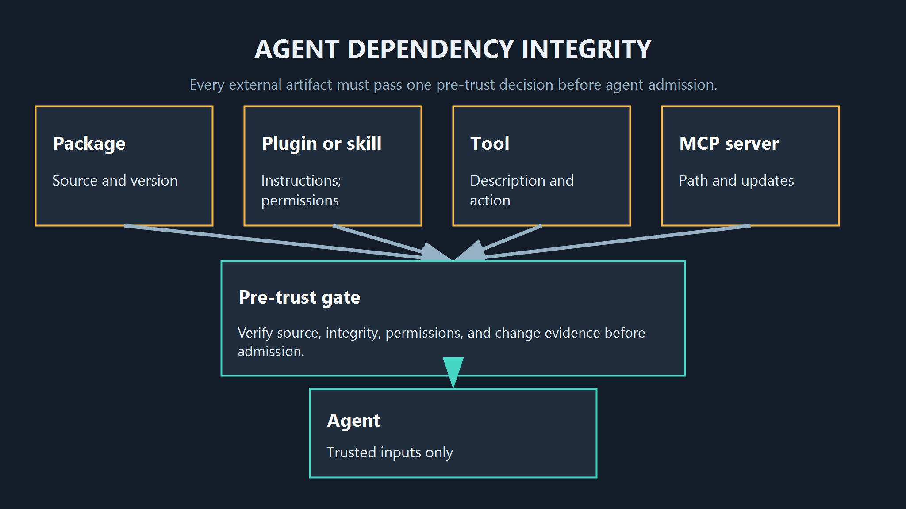
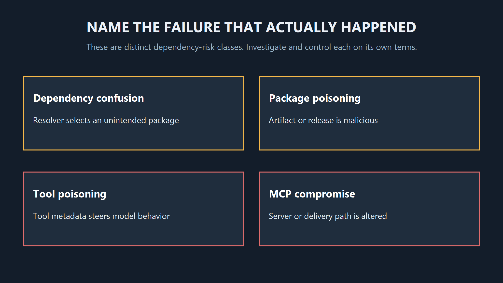
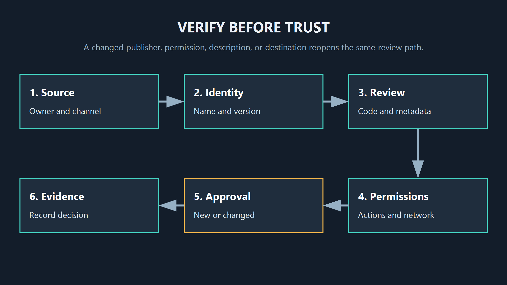

<!--
Source: https://acntglrfp7bm.feishu.cn/wiki/Z3mEw8U4pibfevkIA4XcMEwrndc
Feishu document id: IxOCdSDIgoQ9V1xqN8Oczhg3ntd
Revision: 25
Exported at: 2026-08-15T13:31:06Z
-->
# Agent Dependency Pollution: A Working Definition

Title: Agent Dependency Pollution: A Working Definition  
SEO title: Agent Dependency Pollution: A Working Definition | AgentGuard  
Description: A practical definition for agent dependency pollution, how it differs from related supply-chain threats, and what to verify before an agent trusts a component.  
Route: /glossary/agent-dependency-pollution/  
Canonical: [https://www.agentguard.one/glossary/agent-dependency-pollution/](https://www.agentguard.one/glossary/agent-dependency-pollution/)  
Category: Glossary  
Author: [Author pending approval]  
Status: Draft  
Noindex: true

An agent can make a bad security decision before it ever calls a tool: it can accept a package, plugin, skill, tool description, or MCP server that is not what its owner believes it to be.

TL;DR: `agent dependency pollution` is a useful working label for that integrity problem, but it is not an established standard term. Use a narrower name when the failure is actually dependency confusion, a malicious package, a poisoned tool description, or a compromised MCP supply chain.

## 1. A working definition, not a new standard

In this article, agent dependency pollution means that an AI agent's usable dependency set has been contaminated by an untrusted, misleading, altered, or wrongly resolved component. The component may be code, a package manifest, a plugin, a skill, a tool definition, a server, or the metadata an agent uses to choose one.

The important point is integrity. The failure happens when the agent or its operator treats an artifact as trusted even though its source, contents, identity, version, permissions, or description no longer match the expectation that justified trust.

This is deliberately broader than a single exploit. It does not mean every dependency is malicious, and it does not prove compromise. It gives a team a question to ask: what artifact entered the agent's decision path, and what evidence did we have before we allowed it to influence behavior?

That wording matters because the exact search phrase does not have a stable security-glossary meaning in the Google US results collected for this article. Several results discuss agent workflow dependency graphs rather than software or tool integrity. Calling all of them the same risk would make the diagnosis less useful.

## 2. Name the actual failure class

The working label is most helpful when it forces a distinction. These risks can appear in one workflow, but they are not interchangeable.

| Term | What changes or fails | Typical question |
|-|-|-|
| Dependency confusion | Name resolution selects an unintended public or higher-priority package. | Did the resolver fetch the package we meant to use? |
| Package poisoning | A package, update, or account is malicious or compromised. | Is this release safe to install or update? |
| Tool poisoning | A tool's description or instructions steer the model toward unsafe behavior. | Can the tool metadata manipulate the agent? |
| MCP supply-chain compromise | An MCP server, its distribution path, dependencies, or updates are compromised. | Can this server and its path be trusted? |

### Dependency confusion is a resolution problem

Dependency confusion is about how a build or install process chooses between packages with the same or similar identity. It can be severe, but it does not require an AI agent. An agent can increase exposure if it installs dependencies autonomously, yet the thing to investigate is still resolution policy, registry scope, and package provenance.

### Package poisoning is an artifact problem

Package poisoning refers to a harmful package or harmful update. The package may be intentionally published, modified after an account takeover, or introduced through a compromised release process. The relevant evidence is the publisher, version history, artifact content, declared permissions, and reproducibility of the build.

### Tool poisoning is a model-guidance problem

Tool poisoning targets the text or metadata that a model reads when it selects and invokes a tool. Invariant's [technical disclosure of MCP tool poisoning](https://invariantlabs.ai/blog/mcp-security-notification-tool-poisoning-attacks) describes a named attack where a malicious server's tool descriptions can influence agent behavior and expose sensitive data. That is not the same as a malicious package, although one compromised component can enable the other.

### MCP supply-chain compromise is a system-path problem

MCP supply-chain compromise covers the broader path around a server: where it came from, what it depends on, how it is configured, who can update it, and what it can cause an agent to do. A clean package name does not settle those questions. Nor does a known publisher settle the safety of a later update or a server's tool descriptions.

## 3. How an agent dependency set becomes polluted

The common pattern is not mysterious. A component enters through a selection or update path, the agent receives a weak signal that it is acceptable, and later behavior depends on that signal. The weak signal might be a familiar name, a copied install command, a registry default, a stale allowlist entry, a readable-looking tool description, or a trusted publisher whose account has changed hands.

AI agents add two practical complications. First, they can choose or configure components at machine speed. Second, they may use metadata as instructions. A description that looks like ordinary tool documentation can affect what the model attempts, while the code behind that description can add a different failure path.

The boundary also moves as the agent changes context. A component that was reviewed for one repository may be offered a different credential, dataset, network destination, or tool set in another. A harmless-looking dependency update can therefore become relevant again when its permissions or its surrounding workflow changes. Trust should be attached to a specific version and use case, not to a name alone.

This is why inventories matter. Keep an inventory of packages, plugins, skills, tool definitions, and MCP servers that are enabled for each agent. Record who approved them, which version was reviewed, what permissions were expected, and which environment uses them. When a component changes, the team can compare the new evidence to the previous decision instead of treating the update as an unrelated event.

There is also a difference between discovery and enablement. An agent may be allowed to discover a component from a registry or a catalog without being allowed to install it, send it secrets, or let it call production systems. Separating those transitions creates practical review points. It gives a team room to ask whether the artifact is authentic, whether its instructions match the intended task, and whether its requested permissions are proportionate.

Pre-trust inspection is therefore a distinct control point. AgentGuard documents [Deep Scan component analysis](https://www.agentguard.one/features/deep-scan) for skills, plugins, agents, and MCP servers, including named categories such as prompt injection, malicious tools, credential leaks, and backdoors. That is useful evidence for a component-review workflow, not evidence that every malicious dependency or poisoned description will be found.

The practical boundary is simple: inspect what you are about to trust, then continue to evaluate actions after trust. A scan can surface reasons to stop, investigate, or request approval. It cannot turn an unknown component into a permanent guarantee.

## 4. Verify before trust, then keep the evidence

Use a small verification path before an agent installs, enables, or connects a component:

1. Record the exact source, owner, version, hash where available, and registry or distribution channel.
2. Compare the requested name and source against an explicit allowlist rather than a loose text match.
3. Read dependencies, install scripts, permissions, network targets, and tool descriptions as separate inputs.
4. Scan or review the artifact before it is placed in a trusted pool.
5. Require an approval step for a new publisher, a changed description, elevated permissions, or a new outbound destination.
6. Retain the decision and the artifact version so a later incident can be reconstructed.

The [MCP security solution scope](https://www.agentguard.one/solutions/mcp-security) is the place to connect this component-level work with how a server will be used in an agent deployment. The current public route should be rechecked before publication; it returned 404 during this article's route verification.

Record who approved the component, which evidence supported that decision, the exact version reviewed, and when the trust decision must be revisited.

Risk decisions should also be traceable. The [NIST AI Risk Management Framework](https://www.nist.gov/itl/ai-risk-management-framework) is not an MCP-specific control catalog, but it supports the discipline of documenting how risks are governed, measured, and managed instead of treating a one-time scan as the whole program.

### One CTA

If your team is adding skills, plugins, packages, or MCP servers faster than it can inspect them, [review the component-scanning workflow with AgentGuard](https://www.agentguard.one/contact) before turning new artifacts into trusted agent inputs.

## 5. FAQ and the runtime boundary

### Is agent dependency pollution the same as prompt injection?

No. Prompt injection concerns instructions that influence a model. It can arrive through a poisoned tool description or a compromised component, but a dependency-integrity failure can also involve package resolution, a malicious update, or excessive permissions without any prompt injection.

### Does a known publisher make a component safe?

No. Publisher reputation is one signal. Teams still need to check the exact version, release path, dependency changes, permissions, and whether the component's behavior matches the approved use case.

### Is component review enough after installation?

No. Component review happens before trust. Once an agent acts, the target, parameters, policy, and outcome still matter. [Runtime Guard controls](https://www.agentguard.one/features/runtime-guard) describe a different action-evaluation layer, and current AgentGuard material says it cannot fully monitor or block all third-party MCP server runtime calls. Keep that limitation in the control design.

The useful outcome is not a new label. It is a repeatable decision: identify the artifact, name the actual failure class, verify it before trust, and retain the evidence for the next change.