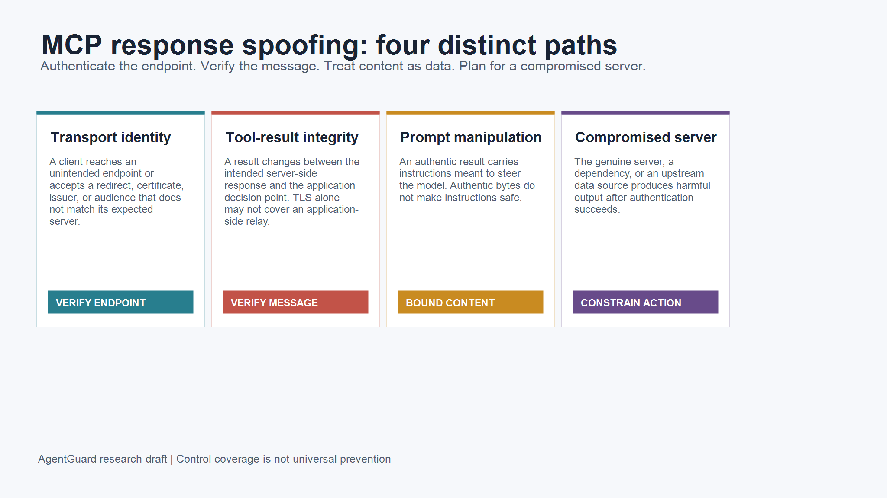
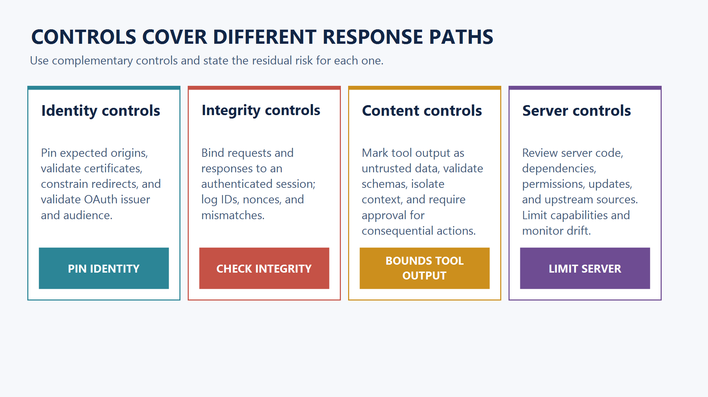
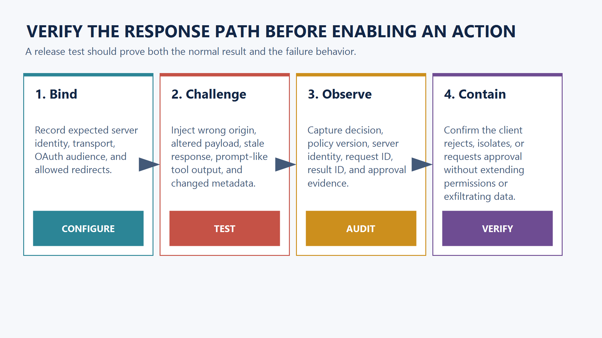

<!--
Source: https://acntglrfp7bm.feishu.cn/wiki/ELWowFKbviRxrLk0M5nchgpAnDe
Feishu document id: UhzidwhdFoCZUBx5yuLcOrUznVe
Revision: 20
Exported at: 2026-08-15T13:31:06Z
-->
# Can You Trust an MCP Response? Four Failure Paths to Test

Title: Can You Trust an MCP Response? Four Failure Paths to Test  
Category: Guides  
Slug: how-to-prevent-mcp-response-spoofing  
Canonical: [https://www.agentguard.one/guides/how-to-prevent-mcp-response-spoofing/](https://www.agentguard.one/guides/how-to-prevent-mcp-response-spoofing/)  
SEO Title: MCP Response Spoofing: Prevention and Testing | AgentGuard  
SEO Description: Prevent MCP response spoofing by separating endpoint identity, message integrity, prompt manipulation, and compromised-server behavior.  
Author: [Author pending approval]  
Publication status: Draft for review; noindex until route and publication fields are approved.

An MCP response can look legitimate for different reasons, and those reasons are easy to confuse. A client may be talking to the wrong server. A response may change after a legitimate server produced it. The response may be authentic but contain instructions that should never influence an agent. Or the real server may have been compromised.

TL;DR: prevent response spoofing by verifying the endpoint, binding and validating messages where your architecture permits it, treating tool output as untrusted data, and limiting what a server can cause an agent to do. Each layer leaves a different residual risk.

## 1. Define the problem before choosing a control

“MCP response spoofing” is a useful operational label, not one protocol-defined vulnerability. It means a client, host, or agent accepts a response as trustworthy when the identity, integrity, meaning, or behavior behind it does not match the security decision being made.

The distinction matters. A certificate failure and a malicious instruction embedded in a customer-support ticket need different tests. Treating both as “bad output” leads to controls that are too broad to implement and too vague to verify.

The MCP [Security Best Practices](https://modelcontextprotocol.io/specification/draft/basic/security_best_practices) document is the protocol-level starting point. It complements authorization guidance; it does not turn an authenticated server into a trusted source of instructions or business data.

## 2. Separate the four response paths

### Transport identity failure

The client connects to an endpoint it did not intend to trust, or accepts a redirect, issuer, certificate, or token audience that does not match the expected server. This is the path closest to ordinary endpoint impersonation.

Use HTTPS with normal certificate validation. Pin the expected origin in configuration, restrict redirects, and validate the OAuth issuer and audience against the server you intended to call. Keep discovery and callback handling narrow enough that a hostile origin cannot choose the resource server for you.

Residual risk: those controls do not prove that a correctly identified server is well implemented, safe, or uncompromised.

### Tool-result integrity failure

A legitimate server produces a result, but a proxy, middleware component, host integration, or local relay changes it before the application decides what to do. Transport encryption protects a hop; it does not automatically prove application-layer integrity after termination.

Bind the request and response to a session and a request identifier. Reject unexpected response IDs, stale timestamps, and replayed messages. Preserve enough audit data to compare the server result with the result that reached the decision layer. Where you operate both ends or a signing boundary, use message-level integrity protection rather than assuming TLS covers every relay.

Residual risk: integrity checks can show that bytes changed, but they do not tell you whether an intact response is safe to act on.

### Prompt manipulation in authentic tool output

An authentic response can contain text crafted to steer a model: an issue title, a document excerpt, a search result, or a field returned by a tool. This is indirect prompt injection. It is not evidence that the network transport failed.

Treat returned tool content as data with a declared schema and a source label. Do not merge it into privileged instructions. Limit the tool result to the fields needed for the current task, strip or quarantine instruction-like content where possible, and require explicit approval before an agent turns result text into a sensitive command, external request, credential use, or data export.

The [OWASP MCP Security Cheat Sheet](https://cheatsheetseries.owasp.org/cheatsheets/MCP_Security_Cheat_Sheet.html) explicitly calls out prompt injection through tool return values and recommends validation, isolation, least privilege, and human review for sensitive actions.

Residual risk: content filters and schemas reduce exposure but do not solve all semantic manipulation. A trusted human or policy still needs to decide what actions remain acceptable.

### Compromised-server behavior

The certificate, OAuth flow, and server name can all be correct while the server code, dependency, configuration, update channel, or upstream data source returns harmful content. This is not spoofing in the narrow identity sense. It is a trust failure in a legitimate connection.

Review the server before connection: publisher, source, version, permissions, dependencies, declared tools, update behavior, and reachable destinations. Recheck when an update, configuration, tool schema, or permission changes. Sandbox servers with a small filesystem and network surface, then keep credentials scoped to the exact resource and action they need.

Residual risk: a review is a point-in-time judgment. New dependencies, drift, and a trusted upstream system can change behavior after approval.

## 3. Map controls to the path they actually cover

| Control | Primary path | What it proves | What it does not prove |
|-|-|-|-|
| Origin, TLS, redirect, issuer, and audience validation | Transport identity | The client is talking to the expected authenticated endpoint | The server is safe or its output is safe |
| Request IDs, expiry, nonce/replay checks, and message protection | Result integrity | The decision layer can reject mismatched or replayed messages | The meaning of a valid message is benign |
| Output schema, data/instruction separation, and approval | Prompt manipulation | Tool content is constrained before it drives a sensitive action | Every indirect prompt injection is recognized |
| Server review, isolation, scopes, drift monitoring, and action policy | Compromised server | A compromised server has fewer permissions and a smaller blast radius | A review permanently establishes trust |

For implementation details and current integration guidance, use the [AgentGuard documentation](https://www.agentguard.one/docs). The article does not claim that AgentGuard supplies endpoint identity or message signing, because that coverage is not publicly verified.

### Make the trust decision observable

Most response-handling failures become difficult to investigate because the host records a final action but not the reasoning path that led there. Log the server identity you expected, the identity you observed, the connection method, the OAuth audience and scope, the tool name, request ID, response ID, policy version, and the decision that followed. Avoid retaining unnecessary tool content or secrets. The point is to preserve a narrow trail that can answer: which server answered, what result was accepted, and which control authorized the next action?

Use separate fields for transport verification and content classification. A result can have `transport_verified=true` while still having `content_trust=untrusted`. That explicit distinction prevents a UI or downstream component from treating a green connection state as approval for a destructive command. It also makes a failed test intelligible: an altered response should fail integrity verification, while a response containing instructions should reach the content boundary and require a policy or human decision.

For remote servers, keep connection policy in versioned configuration rather than in a prompt or user-controlled setting. The allowlist should specify the exact service origin and the approved authorization audience. For local servers, bind the executable path, package version, and command arguments to the approved record. A stable display name is not enough; it does not identify a binary, a container image, or an endpoint.

### Avoid a confused security boundary

Do not ask the model to decide whether a tool result is authorized to expand its own privileges. The model can summarize the result or request a next step, but the host should enforce the scope and action policy outside the model's text context. For example, an issue-tracker tool may return a plausible instruction to download a file. The host can let the agent describe that request, but a filesystem write or outbound network call should still pass its own destination, scope, and approval checks.

This separation also matters for multi-server sessions. A response from one MCP server should not be able to redefine another server's tool, alter its authorization scope, or silently trigger it. Namespace server tools, display the source on returned content, and require a fresh host-side decision for a cross-server action. That does not eliminate model-level influence, but it prevents a response from acquiring privileges merely because it appears in the same context window.

## 4. Verify prevention with negative tests

A control is not established because it appears in a deployment diagram. Test the failure behavior before enabling consequential tools.

1. Configure an allowlist of expected server origins, redirects, OAuth issuer, audience, and scopes. Record the expected tool names and the actions that may follow a result.
2. Attempt a connection through the wrong origin, an unexpected redirect, and a token with the wrong audience. The client should fail before it accepts a tool response.
3. Alter a response in a test relay, replay an earlier response, and return an unexpected response ID. Confirm that the decision layer rejects it and keeps an auditable reason.
4. Return valid-looking content that contains a request to reveal a secret, change policy, or call another tool. Confirm it is treated as data and that sensitive execution requires an approved policy or a human decision.
5. Change tool metadata, a dependency version, and an upstream-data fixture. Confirm the review or drift control catches the change and the server cannot gain new access silently.

The public [Quickstart](https://www.agentguard.one/docs/quickstart) is a useful place to confirm the supported integration path before a test. Protection depth depends on that path; a documented API or CLI should not be described as universal runtime interception.

Run the negative tests with a documented integration in a non-production environment, and keep the result for review.

> Ready to turn the test plan into a scoped evaluation? [Open the AgentGuard Quickstart](https://www.agentguard.one/docs/quickstart).

## 5. Use AgentGuard at the right boundary

AgentGuard documents Deep Scan for skills, plugins, agents, and MCP servers, including named component risks such as prompt injection and malicious tools. It also documents Runtime Guard evaluation for named high-risk actions before execution. Those controls fit server admission and downstream action boundaries.

They do not replace endpoint validation, message integrity design, or an application rule that separates tool data from instructions. Current public material also says AgentGuard cannot fully monitor or block every third-party MCP server runtime call. Keep that limitation in the threat model.

For a controlled evaluation, start from the [AgentGuard home page](https://www.agentguard.one/) and select one supported integration. Test an allowed action, a denied action, and a response that tries to influence the next action. Record the integration mode and the unresolved paths.

## 6. A release checklist

- Expected origin, redirect policy, certificate validation, issuer, audience, and scopes are explicit.
- Requests and responses have correlation IDs, expiry rules, replay handling, and retained audit evidence.
- Tool output has a minimal schema and an untrusted-data boundary.
- Sensitive actions need a policy decision or human approval independent of tool-output text.
- Server code, dependencies, permissions, tool metadata, and updates have an owner and a change-review path.
- The test suite includes wrong endpoint, altered response, stale response, prompt-like output, and changed-server cases.

## Frequently asked questions

### Is MCP response spoofing the same as prompt injection?

No. Prompt injection can arrive inside an authentic tool response. Response spoofing also includes identity and integrity failures. The control you choose depends on which trust statement failed.

### Does TLS prevent every altered MCP response?

No. TLS protects transport between its endpoints. It does not automatically protect an application-side relay or establish that an intact, authenticated result is safe for an agent to act on.

### Can OAuth prove that an MCP server is safe?

OAuth can help establish who receives a token and whether a token is meant for that audience. It does not prove the server code, dependencies, or upstream data are trustworthy.

### What is the minimum practical test?

Test one wrong endpoint, one altered or replayed response, one instruction-bearing result, and one post-approval server change. Record whether the client rejected, isolated, or requested approval for each case.

Before connecting another server, review its trust boundary and run those tests in a non-production environment. [Review AgentGuard](https://www.agentguard.one/) only after you have identified which response path needs coverage.