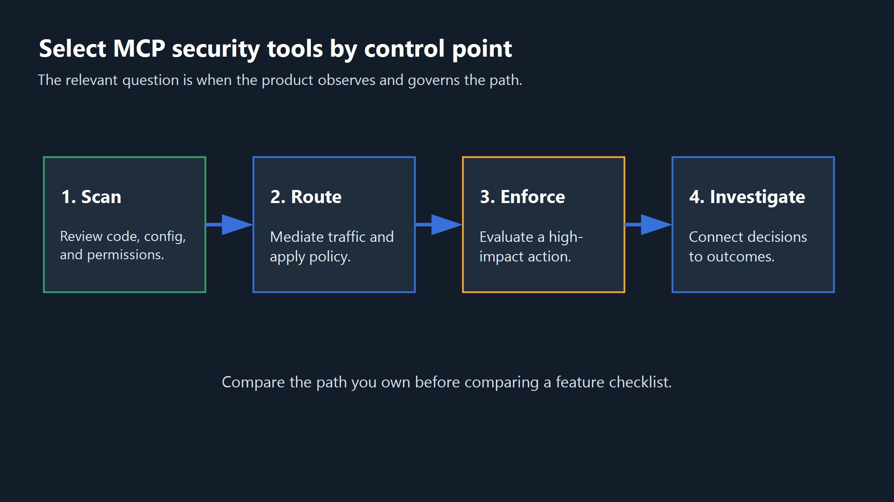
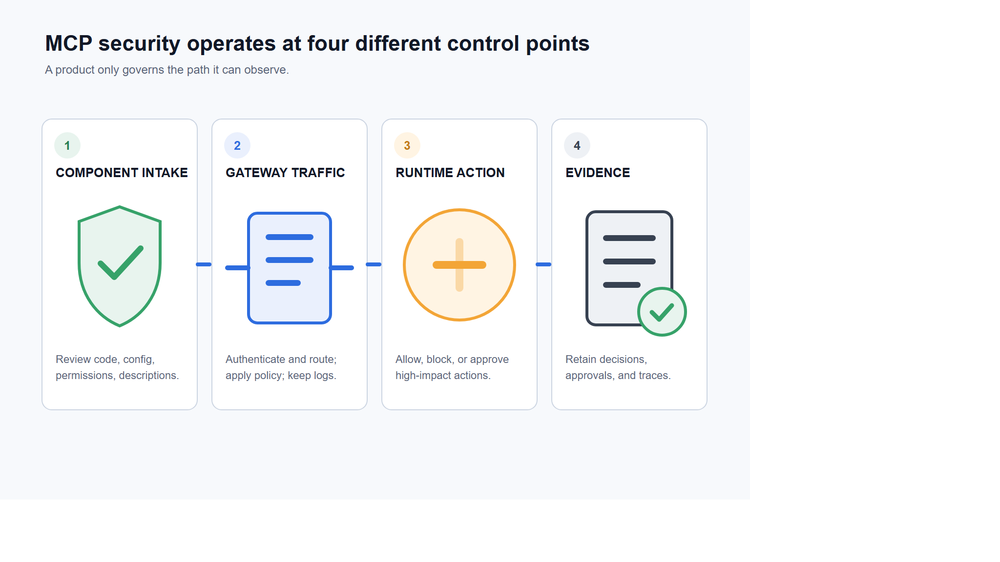
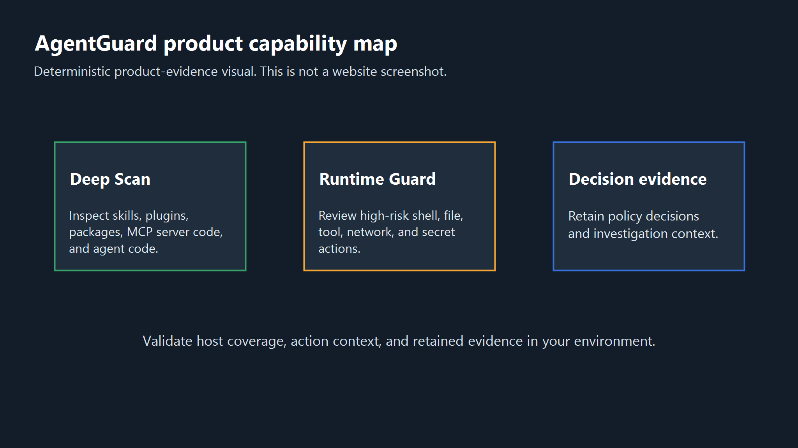
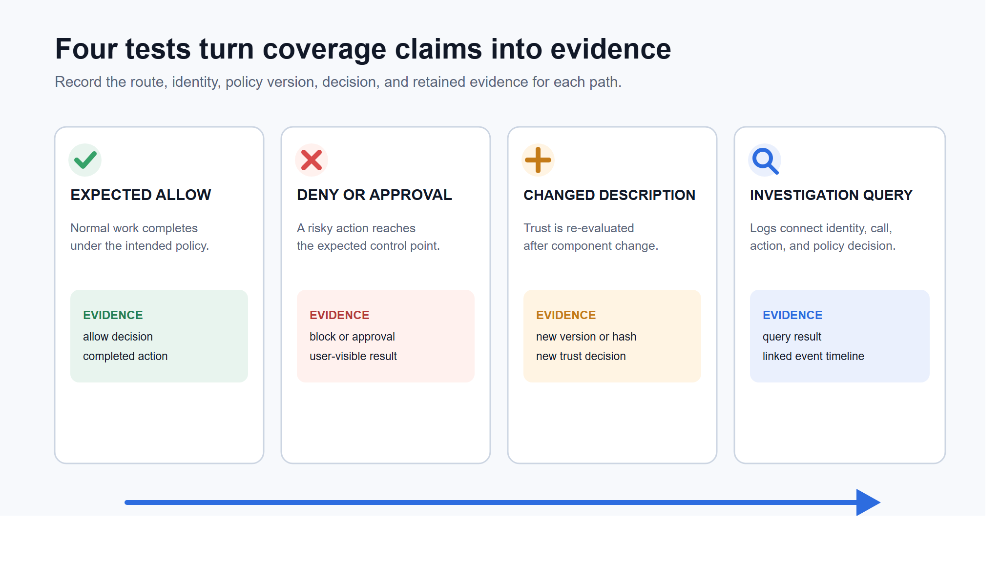
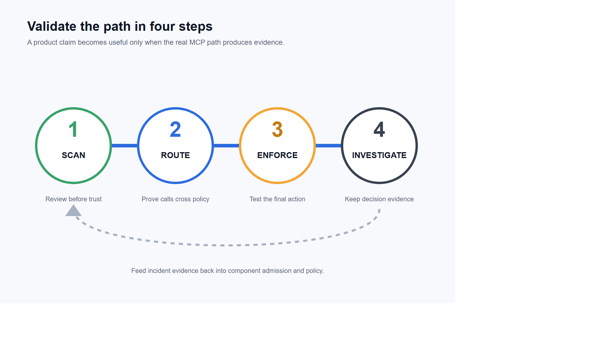

<!--
Source: https://acntglrfp7bm.feishu.cn/wiki/Tm5awBSpIiYMy8kEGq5caDSznYT
Feishu document id: UqIDdFhjDolHewxwJ9QcUjS4nre
Revision: 95
Exported at: 2026-08-15T13:31:06Z
-->
# Which MCP Security Tool Fits Your Stack? 7 Options Compared

```text
title: "Which MCP Security Tool Fits Your Stack? 7 Options Compared"
seoTitle: "MCP Security Tools Compared: 7 Options for 2026 | AgentGuard"
description: "Compare seven MCP security tools by control point, evidence, deployment model, and coverage gaps across scanning, gateways, runtime, and posture."
slug: "/best/mcp-security-tools"
canonical: "https://www.agentguard.one/best/mcp-security-tools/"
category: "Best"
author: "[Author pending approval]"
status: "draft"
noindex: true
primaryKeyword: "mcp security tools"
```



An MCP scanner, a gateway, and a runtime policy engine can all reduce MCP risk. They act at different points, though, so calling one the overall winner hides the gaps a buyer still has to cover.

> TL;DR: Start with AgentGuard when you need component scanning plus action evaluation in supported agent paths; choose Invariant MCP-Scan for open-source tool-description review; choose MCP Manager when routed traffic policy and investigation are the priority. None of the three covers every MCP path, so verify routing and runtime boundaries before buying.

## Quick Shortlist: Seven MCP Security Tools by Control Point

This table is a category map, not a rank. "Best for" describes the strongest fit supported by the reviewed public evidence.

| Tool | Best for | Primary control points | Verified public evidence | Main boundary |
|-|-|-|-|-|
| AgentGuard | Component scanning plus action evaluation in supported agent paths | Component scanner, runtime control | Deep Scan, Runtime Guard, scan and action-evaluation APIs | Does not fully monitor or block all third-party MCP runtime calls |
| Invariant MCP-Scan | Open-source review of installed servers and tool descriptions | Component scanner, trust/posture | Tool poisoning and rug-pull checks, tool pinning, local and API analysis | Shares tool names and descriptions with Invariant when API analysis runs |
| MCP Manager | Managed policy and investigation for routed MCP traffic | Gateway enforcement, investigation | Authentication, restrictions, approvals, logs, and alerts | Independent efficacy and out-of-path coverage were not established |
| MintMCP | Managed server lifecycle, identity, and connectors | Gateway enforcement, trust/posture | Hosting, OAuth/SAML/SSO, rate limits, audit logs, PII and secret scanning | Connector depth and policy efficacy were not tested |
| Lasso MCP Gateway | Open-source gateway with pluggable guardrails | Gateway enforcement, component scan | Request/response interception, masking, reputation checks, plugins, tracing | Advanced Lasso checks require its plugin and API |
| Operant AI | Enterprise MCP discovery, policy, enforcement, and investigation | Trust/posture, gateway, runtime, investigation | Inventory, telemetry, trust zones, least privilege, redaction, blocking | Broad coverage language was not independently validated |
| Straiker | MCP controls inside a broader agent-security program | General AI security, trust/posture, runtime | Inventory, connection testing, and runtime guardrail positioning | Vendor metrics and universal claims were excluded |

The right shortlist may contain more than one row. A team can use a scanner to review a server before admission, a gateway to mediate remote traffic, and a runtime control to review the downstream action that the agent attempts.

## Why One MCP Security Ranking Is Misleading

The label "MCP security tool" covers at least six jobs: component scanning, trust and posture, gateway enforcement, runtime action control, investigation, and broader AI security management. A product may cover several jobs, but the overlap is rarely complete.

Start with the [MCP security control layers](https://www.agentguard.one/solutions/mcp-security), not a vendor score. A scanner can flag a poisoned tool description before connection. It cannot automatically enforce every later call. A gateway can apply policy to traffic routed through it. It cannot inspect a path that bypasses it.

Runtime controls add another boundary. They evaluate an action where a supported agent or host exposes that action for review. Discovery and investigation products answer a different question: what is connected, which identity used it, and what evidence remains after an event?

AgentGuard publishes this comparison and appears in the shortlist. We use the same fields for every product, identify first-party evidence as vendor evidence, and state the current AgentGuard limitation beside its capabilities. We did not run an independent detection or performance test for any product in this article.

## How We Evaluated MCP Security Tools

We evaluated fit rather than assigning one total score. Each profile answers five questions: where the tool acts, which buyer job it serves, what its public documentation supports, what operating dependency it introduces, and what remains unverified.

### Control-Point Fit

The official [MCP Security Best Practices](https://modelcontextprotocol.io/docs/2025-11-25/tutorials/security/security_best_practices) documentation is a useful boundary check. It covers authorization, proxy risks, sessions, local server compromise, scope minimization, and other implementation issues. No single product field represents that whole surface.

We mapped each tool to the first point where it can make or record a security decision. Component scanners act on code, configuration, packages, or tool descriptions. Gateways act on requests and responses that pass through them. Runtime controls act on an observable command, file access, network request, or tool action. Posture and investigation products build inventory or reconstruct the sequence around those decisions.

The mapping exposes overlap without treating overlap as equivalence. Two products may both detect prompt injection, for example, while one checks a static tool description and the other checks a live response. The detection label is similar. The timing, available context, and possible enforcement action are not.

### Evidence Quality and Operating Boundary

We treated vendor pages and repositories as evidence of documented capabilities, not proof of efficacy. We excluded unverified accuracy, latency, price, adoption, and compliance claims. When a reviewed page did not answer a question, the profile says that public evidence does not establish the answer.

We also looked for operating details that change the security result: which path must be routed through the product, which host or agent integration exposes an action, whether an external analysis API receives metadata, and which logs remain available for review. These details matter more than a long feature list because they define where a policy can make a decision.

A useful buying claim should survive a concrete question. Ask which exact request, response, component, identity, or action the product evaluates. Then ask what happens on allow, deny, timeout, product outage, or bypass. Public documentation rarely answers that full sequence, so the unanswered parts become proof-of-concept requirements rather than negative claims.

The shortlist also favors products with a distinct buyer job. General integration platforms may have useful security features, but they were left out when the reviewed evidence did not make MCP security a primary task.



Figure 1. MCP security tools act before connection, in a mediated traffic path, at action execution, or during investigation. Coverage at one point does not prove coverage at the others.

## Best MCP Security Tools for Scanning and Trust

Scanning tools address the earliest decision: should this component or tool description enter the trusted environment? Their evidence is tied to the version and content they inspected. Re-run the check after code, metadata, permissions, endpoints, or tool descriptions change.

## AgentGuard: Best for Component Scanning Plus Supported Runtime Controls



### Overview

AgentGuard documents Deep Scan for skills, plugins, MCP server code, packages, and agent runtime code. Its public API reference also describes scan endpoints for submitted content and URLs. That makes it a fit for teams that want component review inside the same product family as action evaluation.

The [Deep Scan component analysis](https://www.agentguard.one/features/deep-scan) evidence names prompt injection, malicious commands, credential exposure, data exfiltration, permission abuse, and URL analysis as detection areas. Those are documented product claims. This comparison does not claim that every malicious component or poisoned description will be detected.

Runtime Guard covers a later point. AgentGuard documents evaluation for shell, file, tool, network, secret, sensitive-write, and webhook-exfiltration actions before execution. The API reference lists action evaluation, effective policy, audit ingestion, approvals, and session endpoints.

AgentGuard's public FAQ says the product supports MCP server scanning and MCP-related integrations, but should not be described as fully monitoring or blocking all third-party MCP runtime calls. Runtime depth depends on the integration path that exposes the action to AgentGuard.

### Pros & Cons

**Pros:** AgentGuard combines documented component scanning with action evaluation for supported agent paths, keeping admission and runtime evidence in one product family. Deep Scan names concrete risk categories, and the public API documents both scan and policy workflows.

**Cons:** AgentGuard does not fully monitor or block every third-party MCP runtime call. Coverage depth depends on the integration path, and this article did not independently test detection quality or performance.

### Pricing

Not publicly verified.

### Other Decision Information

Buyers should inventory MCP calls outside supported AgentGuard paths and assign another control or an explicit exception to each one.

This combination is useful when a team wants one evidence trail across component admission and supported action paths. Buyers should still inventory MCP calls that occur outside those paths and assign another control or an explicit exception to each one.

> Inspect an MCP component before trust: [Open AgentGuard Docs](https://www.agentguard.one/docs).

## Invariant MCP-Scan: Best for Open-Source Tool-Description Scanning

### Overview

Invariant MCP-Scan focuses on installed MCP servers and their tool descriptions. Invariant documents checks for hidden instructions, tool poisoning, cross-origin escalation, prompt injection, and rug pulls. Tool pinning tracks description changes through hashes, which gives teams a concrete re-review trigger.

The tool can analyze descriptions through local checks and the Invariant Guardrails API. Invariant states that tool names and descriptions are shared when API analysis runs, while tool-call contents and results are not stored or logged by MCP-Scan. Teams with private tool metadata should review that data path before use.

MCP-Scan is a scanner, not a complete traffic gateway. It is strongest at installation review and change detection. A buyer still needs separate answers for identity, authorization, runtime policy, and incident evidence after a tool is admitted.

### Pros & Cons

**Pros:** MCP-Scan is open source, focuses directly on installed MCP servers and tool descriptions, and uses tool pinning to make description changes visible.

**Cons:** API analysis can share tool names and descriptions with Invariant. The product is a scanner rather than a complete identity, gateway, runtime-policy, or investigation layer.

### Pricing

Not publicly verified.

### Other Decision Information

Buyers with private tool metadata should review the analysis data path, then pair the scanner with separate controls for identity, authorization, runtime policy, and incident evidence.

## Best MCP Gateways for Enforcement and Investigation

A gateway can authenticate callers, apply policy, inspect requests or responses, and create a shared log. That value depends on routing. Before buying one, map every local and remote MCP path and confirm which clients and servers can be forced through the gateway.

## MCP Manager: Best for a Managed MCP Control Plane

### Overview

MCP Manager describes a gateway between MCP clients and servers. Its security page documents authentication, per-user or per-team tool restrictions, approval enforcement, call logs, alerts, and monitoring. Teams evaluating managed policy and investigation for mediated traffic can test those controls against their own routes.

The same page makes broad claims about protection from MCP attack vectors. We did not validate those claims with an independent attack set, and the public evidence does not establish what happens when a client reaches a server outside the managed path.

Buyers should ask for the exact deployment topology, supported transports, policy evaluation point, log fields, retention options, and failure behavior. A gateway that fails open or covers only selected clients creates a different risk than one that can enforce routing across the target estate.

### Pros & Cons

**Pros:** MCP Manager documents authentication, restrictions, approvals, call logs, alerts, and monitoring in one managed control plane for routed MCP traffic.

**Cons:** This article did not independently validate its attack-coverage claims, and public evidence does not establish protection for traffic that bypasses the gateway.

### Pricing

Not publicly verified.

### Other Decision Information

Ask for the exact deployment topology, supported transports, policy evaluation point, log fields, retention options, and failure behavior.

## MintMCP: Best for Managed Server Lifecycle and Identity

### Overview

MintMCP combines MCP server hosting and lifecycle management with access controls. Its gateway page documents OAuth, SAML, SSO, rate limiting, monitoring, audit logs, PII detection, secret scanning, and managed connectors. It also describes hosting for STDIO-based servers and virtual servers for teams.

That bundle suits organizations whose first problem is operational: too many locally configured servers, credentials, and inconsistent access paths. Centralizing those paths can make policy and audit collection easier, provided the target clients actually use the managed connections.

We did not test connector behavior, secret detection, redaction, or identity integrations. Public evidence also does not establish that every local server or direct connection is automatically brought into the gateway.

### Pros & Cons

**Pros:** MintMCP combines server hosting and lifecycle management with documented identity controls, rate limits, audit logs, and managed connectors.

**Cons:** Connector behavior, secret detection, redaction, and identity integrations were not independently tested. Public evidence does not establish coverage for every local server or direct connection.

### Pricing

Not publicly verified.

### Other Decision Information

Confirm that target clients can be forced through managed connections before treating centralization as coverage.

## Lasso MCP Gateway: Best for an Open-Source Gateway

### Overview

Lasso Security's public MCP Gateway repository describes an intermediary that reads MCP server configuration, manages server lifecycle, and intercepts requests and responses. The basic plugin masks selected secret patterns, and the repository documents optional plugins for PII, policy, prompt injection, harmful content, and tracing.

The repository also describes a security scanner that checks server reputation and risks before loading a server. This gives the project a useful combination of admission checks and traffic mediation for teams willing to operate an open-source gateway.

The buyer owns deployment, updates, configuration, log storage, and failure handling. Advanced Lasso checks require the Lasso plugin and API key, and this article did not test their behavior or production performance.

### Pros & Cons

**Pros:** Lasso provides an open-source intermediary with request and response interception, basic secret masking, tracing, and pre-load server reputation checks.

**Cons:** Buyers own deployment, updates, configuration, log storage, and failure handling. Advanced guardrails require the Lasso plugin and API, whose production behavior was not tested here.

### Pricing

Not publicly verified.

### Other Decision Information

Evaluate the basic open-source gateway and external Lasso-backed checks as separate dependencies, including outage behavior.

## Best Broader Platforms for MCP Discovery and Runtime Control

Broader platforms become relevant when the main problem is estate visibility, cross-environment policy, or one control program for several agent technologies. They are usually heavier than a command-line scanner and wider than a dedicated MCP gateway.

## Operant AI: Best for Cross-Environment MCP Discovery and Enforcement

### Overview

Operant AI positions its MCP Gateway across endpoint and cloud environments. The vendor documents discovery of clients, servers, tools, identities, and traffic; it also describes trust zones, least-privilege controls, input and output inspection, redaction, blocking, and investigation telemetry.

That scope fits an enterprise that needs to find shadow MCP paths before enforcing them. The value depends on how Operant observes each environment and where it can place a control. Buyers should request a path-by-path architecture for developer tools, local servers, remote servers, and cloud agents.

Operant's page uses broad end-to-end and complete-visibility language. We did not validate discovery completeness, detection quality, enforcement latency, or coverage outside supported deployment points. Treat those as demo and proof-of-concept questions.

### Pros & Cons

**Pros:** Operant documents a broad surface across discovery, identity, telemetry, trust zones, least-privilege controls, redaction, blocking, and investigation.

**Cons:** Its end-to-end coverage language was not independently validated. Discovery completeness, detection quality, enforcement latency, and unsupported deployment paths remain proof-of-concept questions.

### Pricing

Not publicly verified.

### Other Decision Information

Request a path-by-path architecture for developer tools, local servers, remote servers, and cloud agents, then test each environment separately.

## Straiker: Best for a Broader Agent-Security Program

### Overview

Straiker maps MCP security across three products. Its public page describes Discover AI for MCP inventory and hygiene scoring, Ascend AI for testing connections, and Defend AI for runtime guardrails on tool calls. That is a program-level fit for teams evaluating discovery, assessment, and production controls together.

The reviewed page also includes accuracy, scan-count, and attack-ranking statistics. We excluded them because this article did not inspect the underlying test design or reproduce the results. We also did not verify that every MCP connection can be discovered or mediated in every environment.

Buyers should separate the three workflows during evaluation. Inventory needs a coverage test, red teaming needs a safe and repeatable attack set, and runtime enforcement needs clear action points, failure behavior, and retained evidence.

### Pros & Cons

**Pros:** Straiker presents MCP inventory, connection testing, and runtime guardrails within one broader agent-security portfolio.

**Cons:** The reviewed page includes marketing statistics and broad coverage claims that this article did not reproduce or validate. Each workflow still needs its own acceptance test.

### Pricing

Not publicly verified.

### Other Decision Information

Evaluate inventory coverage, red-teaming evidence, and runtime enforcement as three separate workflows with separate acceptance criteria.

## How to Combine MCP Security Tools Without Buying Overlapping Controls

Start with the event you need to control. If the risk exists before connection or after a tool-description change, use a scanner or trust control. If the risk appears in routed MCP traffic, use a gateway. If the business impact occurs after the agent chooses a tool, evaluate the resulting action through a supported runtime path.

The [Runtime Guard action evaluation](https://www.agentguard.one/features/runtime-guard) boundary is a useful example. An action control can review a shell command, file access, or tool action only when the integration exposes it. It does not replace server admission, OAuth design, or traffic inspection on an unrelated path.

### Keep a Coverage-Gap Register

Discovery and investigation sit across those layers. Keep a register of clients, servers, tools, identities, routes, policies, approvals, and retained logs. For every path, name the control that sees it and record `uncovered` when none does.

Add the control's failure mode to the same register. Record whether it fails open, fails closed, asks for human approval, or pauses the workflow when its policy service is unavailable. A control that is present but silently bypassed during an outage is a known gap, not defense in depth.

Assign an owner and review trigger to each gap. A local development exception may be temporary; a production integration may need a separate gateway or runtime hook. Revisit the entry when a client, server, identity flow, transport, tool description, or downstream permission changes.

### Run Four Tests Before Buying

Run a proof of concept with one expected allow, one expected block or approval, one changed tool description, and one investigation query. Save the policy version, component version, route, identity, decision, and evidence returned by each test. A product demo without those artifacts does not answer the coverage question.

The allow test proves that normal work still functions under policy. The deny or approval test shows where enforcement occurs and what the user sees. The changed-description test checks whether trust is re-evaluated after admission. The investigation query shows whether the logs can connect an identity, MCP call, downstream action, and policy decision without manual guesswork.

Repeat the same four tests on every deployment path that matters. A remote server behind a gateway, a local STDIO server, and an agent-specific runtime hook may produce three different answers from the same product. Record each result separately instead of promoting one successful demo to estate-wide coverage.



Figure 2. A useful proof of concept records the path, policy version, decision, and retained evidence for all four tests. Passing one test does not establish coverage for another path.

The [CSA's draft Agentic MCP Security Best Practices Guide](https://labs.cloudsecurityalliance.org/agentic/agentic-mcp-security-best-practices-v1/) reaches the same operating conclusion: MCP security needs several control domains. Because the paper is labeled draft, use it as a coverage checklist, not a final compliance standard.

| Buyer question | Primary control | Evidence to request | Common remaining gap |
|-|-|-|-|
| Should this server or tool description be trusted? | Component scanner or trust registry | Scan result, version/hash, changed-description alert | Later runtime behavior |
| Who can reach which MCP server and tool? | Identity-aware gateway | Identity mapping, policy decision, denied-call record | Direct or local bypass paths |
| Can sensitive data leave in a request or response? | Gateway inspection and redaction | Test payload, redaction record, destination policy | Downstream actions outside the gateway |
| Should this high-impact action run? | Runtime action control | Action context, policy version, allow/block/approval decision | Unsupported agents or integrations |
| What happened after an alert? | Investigation and audit layer | Session, identity, tool call, action, and policy timeline | Missing logs from uncovered paths |
| Are new MCP assets appearing? | Discovery and posture | Inventory delta, owner, route, trust status | Ephemeral or disconnected environments |



Figure 3. Choose the control point from the risk timing and path you own. Combine layers only where one product leaves a named gap.

Finish the purchase decision by mapping the architecture. Mark each MCP path with its scanner, gateway, runtime control, and evidence owner. Remove duplicate products unless they cover different environments or provide a tested fallback.

> Map your MCP control gaps: [Book an AgentGuard demo](https://www.agentguard.one/book-demo).

## Frequently Asked Questions

### What Is an MCP Security Tool?

An MCP security tool inspects or controls part of the path between an AI agent, an MCP client, an MCP server, and the downstream system the server can access. The category includes scanners, trust and posture products, gateways, runtime controls, and investigation platforms.

### Is an MCP Gateway Enough to Secure MCP?

Not by itself. A gateway can authenticate, mediate, log, and enforce policy for traffic routed through it. Teams still need to review server and tool integrity before trust, control downstream actions where required, and account for clients or servers that bypass the gateway.

### What Is the Difference Between an MCP Scanner and a Gateway?

A scanner reviews a server, package, configuration, or tool description at a point in time. A gateway sits in a communication path and can apply policy to requests and responses as they pass. Many teams need both because admission risk and runtime traffic risk occur at different times.

### Are Open-Source MCP Security Tools Suitable for Enterprises?

They can be, if the team can review and operate them. Check release ownership, dependencies, update process, deployment isolation, log handling, plugin data flows, support requirements, and the failure mode when an external analysis API is unavailable.

### How Often Should Teams Re-Evaluate MCP Security Tools?

Use event-driven review rather than an annual checkbox. Re-run coverage tests when a server, tool description, client, integration, policy, identity flow, deployment route, or threat model changes. Also schedule a periodic inventory check to catch unowned MCP paths.