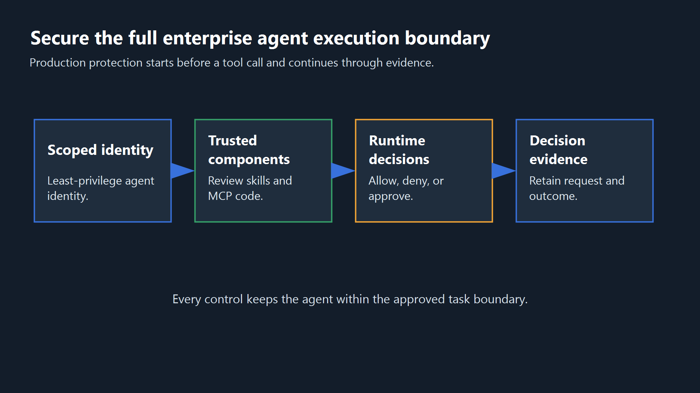
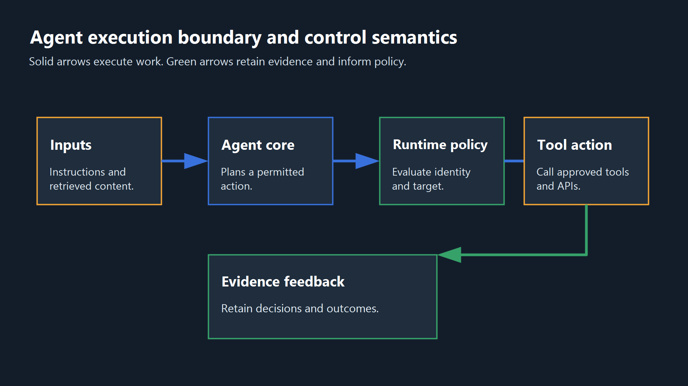
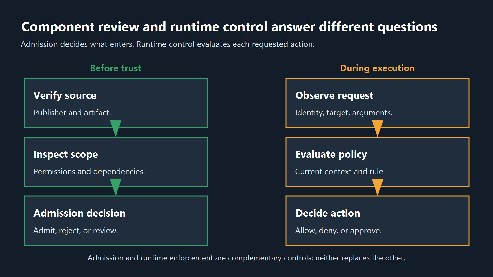
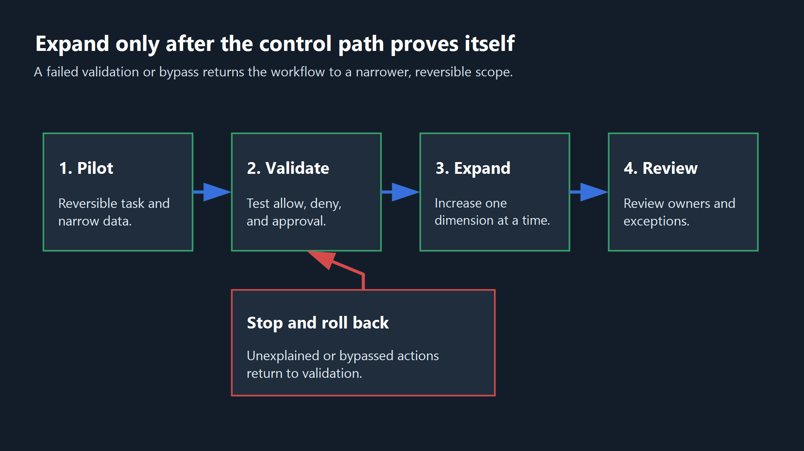

<!--
Source: https://acntglrfp7bm.feishu.cn/wiki/TyCywgbbbin6WJkkkzXcz1yOn9f
Feishu document id: BnQJdEY1zo6vblxp8CScYuYvnCc
Revision: 76
Exported at: 2026-08-15T13:31:06Z
-->
# How Enterprises Can Secure AI Agents in Production

```text
title: "How Enterprises Can Secure AI Agents in Production"
seoTitle: "AI Agent Security Best Practices for Production | AgentGuard"
description: "Learn how to secure enterprise AI agents across identity, tools, runtime actions, memory, monitoring, and governance with a practical rollout checklist."
slug: "/guides/enterprise-ai-agent-security-best-practices"
canonical: "https://www.agentguard.one/guides/enterprise-ai-agent-security-best-practices/"
category: "Guides"
author: "[Author pending approval]"
status: "draft"
noindex: true
primaryKeyword: "ai agent security best practices"
```



Enterprise AI agents do not just generate text. They execute multi-step actions across internal data, APIs, files, and tools, so securing them requires controls across the entire execution boundary.

> TL;DR: Give each agent a scoped identity, restrict its tools and credentials, evaluate high-risk actions at runtime, and retain enough decision evidence to investigate the outcome.

## 1. What Makes Enterprise AI Agent Security Different?

An AI agent combines a model with instructions, state, tools, and an execution loop. It can revise a plan and act again without a new user prompt. The surrounding system therefore belongs inside the security boundary, not only the model input and output.

### Autonomy, Memory, and Multi-Step Execution

A chatbot response usually ends at text generation. An agent may open a file, query a database, call an API, invoke another agent, and then use the result to decide what to do next. A low-impact first step can create a high-impact second step.

Session state, long-term memory, and retrieved documents can influence later decisions. Security teams must know who can write that state, who can read it, which workflow can reuse it, and when it expires.

### Why Model-Only Controls Are Insufficient

Prompt filters and model safeguards address part of the input and output path. They do not scope credentials, approve tool calls, restrict destinations, isolate memory, or preserve investigation evidence.

Place independent controls at identity issuance, component admission, tool routing, action execution, data access, and audit collection. A failure in one layer should not authorize the next action. The broader [AI agent security guide](https://www.agentguard.one/guides/ai-agent-security) explains how those surrounding controls extend beyond model behavior.



Figure 1. The model is one part of the execution boundary. Independent controls must also cover identity, components, actions, data, and evidence.

## 2. Core Security Boundaries and Access Management

Start with an inventory owned by named people. For each production workflow, record the agent identifier, model, instructions, tools, credentials, permitted data, dependencies, expected impact, approval path, and the person who can suspend it.

Version prompts and policies as reviewed configuration. Trace each security decision to the instruction and policy versions active at the time. The [OWASP AI Agent Security Cheat Sheet](https://cheatsheetseries.owasp.org/cheatsheets/AI_Agent_Security_Cheat_Sheet.html) provides a useful coverage check for tools, memory, identity, permissions, and observability, but the final inventory must reflect the organization's actual assets and integrations.

| Asset or path | Access to record | Accountable owner | Potential impact |
|-|-|-|-|
| Agent and orchestration loop | Model, system prompt, delegated tasks | AI platform owner | Unapproved planning or action sequence |
| Tool, plugin, skill, or MCP server | Functions, destinations, permissions, dependencies | AppSec or component owner | Command execution, data access, or changed behavior |
| Agent identity and credentials | Roles, scopes, expiry, approval path | IAM owner | Privilege abuse or cross-system access |
| Memory and RAG sources | Writers, readers, retention, tenant boundary | Data owner | Persistent manipulation or cross-user exposure |
| Logs and audit records | Fields, redaction, retention, access | Security operations | Missing evidence or sensitive-data leakage |

Map every action route, including shell commands, files, databases, SaaS APIs, browser actions, queues, webhooks, and outbound destinations. Record direct and delegated calls as well as credential issuance, lifetime, scopes, and possible exposure in prompts, logs, arguments, or returned content.

### Component Review and Supply Chain Trust

Before trust, review a component's publisher, source, integrity, permissions, dependencies, configuration, update behavior, and external destinations. Apply the same admission process to skills, plugins, packages, agents, tool descriptions, and MCP servers.

Metadata influences component selection; implementation controls behavior after selection. Review both surfaces, pin or verify the reviewed artifact, and retain the version and decision. Re-run the review when code, metadata, permissions, dependencies, endpoints, or signing identity changes.

A pre-deployment review is evidence for a defined version and scope. It does not prove that every runtime argument, destination, or downstream effect will be safe.

### Scoped Identity and Least-Privilege Access

Issue a dedicated identity to each production agent or bounded workflow. Shared accounts and long-lived credentials obstruct attribution and make revocation too broad. The identity record should expose the owner, purpose, environment, allowed tools, destinations, scopes, and expiry.

Human delegation must preserve the user's actual authorization boundary. A child agent must not inherit broader permissions merely because its parent can invoke it. Carry the original user, purpose, and authority through delegated tasks.

Issue credentials for the duration and destination of the task. Rotate or revoke them when the task ends, the agent changes, or a policy test fails. Store the issuance event, scope, expiry, and workload identity as audit evidence.

Place approval outside the agent that proposes the action. Production deletion, financial transfer, credential change, public communication, and high-impact access grants should identify an accountable approver and present the exact target and effect before execution.

For example, a CRM research agent may read approved customer fields for a defined account list. It should not inherit the write scopes of a shared integration account or receive permission to export the full customer table.

### Data, Memory, and RAG Isolation

Classify data before the agent receives it. Give the workflow only the fields, documents, and retention period required for the task. The data boundary should match the approved workflow, not every data source the organization can technically connect.

Separate state by tenant, user, purpose, and environment. Test whether one identity can retrieve another identity's memory. Record the writer, source, timestamp, version, and expiry for durable entries.

Redact secrets and unnecessary personal data before prompts, logs, and traces are stored. Define retention by evidence need rather than convenience, and verify that deletion removes data from indexes and derived stores as well as the visible conversation.

Label the source and trust status of retrieved content. Keep external text separate from system instructions, but do not rely on formatting alone. Apply authorization again when retrieved content influences a tool call or data-access decision.

## 3. Safeguards for High-Risk Actions and Failure Paths

Trace each risk from an attacker-controlled or mistaken input to business impact, then identify the control point that can interrupt it. Prioritize failure paths by the action they can cause rather than by how novel the prompt or technique appears.

### Prioritizing Critical Failure Paths

| Failure path | Possible impact | Primary control point | Evidence to retain |
|-|-|-|-|
| Indirect prompt injection in retrieved content | Unauthorized instruction or data transfer | Content trust boundary and action policy | Source, instruction version, requested action, decision |
| Unsafe tool use with broad permissions | Destructive write or external side effect | Scoped identity and approval gate | Identity, scope, target, approver, outcome |
| Poisoned memory or shared state | Persistent behavior change or cross-user exposure | Write authorization and memory isolation | Writer, tenant, version, expiry, retrieval event |
| Credential abuse | Access outside the task boundary | Short-lived credentials and destination policy | Issuance, scope, expiry, destination, use |
| Multi-agent cascade | Delegated action exceeds the original authority | Delegation policy and end-to-end trace | Parent task, child agent, inherited authority, final action |

- Indirect prompt injection and instruction hijacking: retrieved content may contain instructions that compete with system policy. The action layer must still authorize the resulting request for its identity, target, and context.
- Unsafe tool use and excessive permissions: a legitimate tool can produce an unsafe result with the wrong target, argument, or scope. Restrict actions, validate parameters, and require independent approval for irreversible operations.
- Memory poisoning and cross-session exposure: misleading content can persist in reusable state. Limit durable-memory writers, isolate state by user and workflow, and retain each item's source and version.
- Credential abuse and data exfiltration: an agent can misuse a credential without revealing it by calling an approved integration with an unapproved destination or payload. Bind credentials to narrow scopes, short lifetimes, and explicit destinations.
- Multi-agent cascading failures: delegated tasks can exceed the original authority when parent context and policy are not preserved. Trace the parent task, child identity, inherited authority, and final action together.

### Evaluating High-Risk Actions During Execution

Admission review cannot predict every runtime argument or destination. Evaluate high-impact actions using the actual identity, target, parameters, data class, current policy, and requested outcome.

Write policy around observable actions. Specify which commands, file paths, tools, network destinations, secrets, sensitive writes, and outbound payloads are allowed, denied, or sent for approval. Avoid a single broad label such as `high risk` without criteria.

Run one expected-allow test and one prohibited or approval-required test through the same integration used in production. Confirm that the normal action succeeds without a bypass and that the high-risk action produces the intended decision. Retain the request, identity, policy version, reason, target, approval, and outcome.

Maintain an unsupported-path register for direct SDK calls, alternate tools, child agents, fallback connectors, and third-party MCP runtime calls that do not pass through the monitored route. Assign an owner and compensating control to each entry.



Figure 2. Component review decides what may enter the system; runtime control evaluates what an admitted component or agent is attempting now. Neither control replaces the other.

> Evaluate the real execution path before expanding access. Review the documented action categories in [Runtime Guard](https://www.agentguard.one/features/runtime-guard), then test one allowed action and one denied or approval-required action through a production-like integration.

## 4. Monitoring, Auditing, and Incident Response

Monitoring should reconstruct both the attempt and the control response. Collect identity, parent task, tool, target, policy version, approval, result, and relevant state references without retaining unnecessary sensitive content.

### Detecting Unexpected Tool Calls and Access Patterns

Alert on new tools, new destinations, denied actions, repeated approval requests, unusual credential use, and deviations from the workflow's declared purpose. Compare actual actions with the workflow's registered tools, data, destinations, and impact boundary.

Detection should distinguish a request that was denied, an action that was approved, an action that bypassed the policy route, and an action that completed with an unexpected downstream result. Those states require different incident responses.

### Retaining Decision and Outcome Evidence

Keep the request and final outcome together. A policy engine may allow a request that later fails, or a tool may modify a different object than the agent expected. Investigation requires both the decision record and the downstream result.

Evidence should answer who initiated the task, which agent and policy version acted, which component and credential were used, what target and parameters were requested, what decision was made, who approved it, and what the external system reported afterward.

Retention must balance investigation needs with data minimization. Record stable identifiers and essential context instead of copying entire prompts, secrets, or documents into every trace.

### Containment and Rotation Protocols

An agent incident runbook should disable the workflow, revoke credentials, stop queued tasks, preserve evidence, inspect affected memory, and identify downstream actions. Containment must cover child agents and alternate integrations, not only the original interface.

After containment, review the component version, policy, identity scopes, memory state, test cases, and unsupported-path register. Restore access only after the team can explain the failure and demonstrate that the revised control path handles it.

## 5. Enterprise Rollout and Governance Framework

Governance should turn technical controls into accountable decisions. For every deployed workflow, define an owner, risk classification, approval rule, test, evidence record, exception process, and review cadence.

### Mapping Technical Controls to Governance

Frameworks organize responsibility; naming them does not implement a control. Translate each relevant requirement into a decision owner, control point, validation test, retained record, and review trigger.

The [NIST AI Risk Management Framework](https://www.nist.gov/itl/ai-risk-management-framework) organizes AI risk work around govern, map, measure, and manage. Apply those functions to workflow ownership, inventory, evaluation, runtime enforcement, incident response, and review evidence rather than treating the framework name as proof of compliance.

### A Staged Rollout Path

Pilot a reversible internal workflow with non-sensitive data, narrow destinations, and a named owner. Define allowed and prohibited actions before enabling the agent.

Validate allow, deny, and approval paths through the production-like integration. Confirm that an operator can reconstruct the result and register every bypass before expansion.

Expand one dimension at a time: data class, tools, users, or action impact. Roll back when evidence cannot explain an action or a policy route is bypassed.

Review ownership, components, permissions, incidents, exceptions, and unsupported paths after material changes and on a fixed schedule. Require evidence before the next expansion decision.



Figure 3. Expand one dimension at a time only after the control path and retained evidence explain what the agent attempted and what happened.

### Common Mistakes and When Not to Deploy Autonomous Agents

Standing broad credentials turn a narrow task error into a wider incident. One-time review misses component changes, while unmonitored tools and MCP paths bypass the approved policy route. A policy configured in a dashboard is not evidence that the production action passed through it.

Do not deploy an autonomous agent when deterministic software can complete the task reliably with fewer permissions. Keep human execution when the action is irreversible, accountability cannot be delegated, or the team cannot observe and stop the workflow.

Delay deployment when no owner can explain the tools, data, identity, failure impact, control path, and investigation evidence. A smaller scope is preferable to an untestable promise of broad autonomy.

### The Enterprise Implementation Checklist

1. Inventory the workflow. Owner: AI platform lead. Test: reconcile deployed agents against the registry. Evidence: agent ID, purpose, model, tools, data, and owner.
2. Classify the impact. Owner: business and security owners. Test: simulate failure for each high-impact action. Evidence: impact rating and approval rule.
3. Review components before trust. Owner: AppSec. Test: compare the reviewed version, permissions, dependencies, and destinations with deployment. Evidence: artifact hash and review decision.
4. Issue a scoped identity. Owner: IAM. Test: attempt one allowed and one excess-scope request. Evidence: identity, scopes, expiry, and result.
5. Set data and memory boundaries. Owner: data owner. Test: attempt cross-user retrieval and expired-memory access. Evidence: isolation result, retention policy, and deletion record.
6. Apply runtime action policy. Owner: security engineering. Test: exercise one expected action and one prohibited or approval-required action. Evidence: request, policy version, decision, and outcome.
7. Configure independent approval. Owner: control owner. Test: attempt an irreversible action without approval. Evidence: approver, target, decision, and timestamp.
8. Collect investigation evidence. Owner: security operations. Test: reconstruct a completed task. Evidence: actor, parent task, tool, target, decision, and result.
9. Exercise containment. Owner: incident response. Test: disable the agent, revoke credentials, and stop queued work. Evidence: exercise timeline and recovery decision.
10. Review unsupported paths. Owner: platform and security leads. Test: trace direct SDK, delegated, fallback, and third-party MCP calls. Evidence: unsupported-path register and compensating control.

## 6. Frequently Asked Questions

### What Is the Difference Between AI Agent Security and Traditional AI Security?

AI agent security covers tools, identities, credentials, memory, delegated tasks, and runtime actions around the model. Model input and output controls remain useful, but they do not govern every downstream action or preserve every decision required for investigation.

### What Are the Biggest Enterprise AI Agent Security Risks?

The highest-impact risks depend on the workflow. Common paths include indirect prompt injection, excessive permissions, unsafe tool arguments, poisoned memory, credential abuse, data exfiltration, and delegated actions that exceed the original authority.

### Do AI Agents Need Their Own Identity and Access Policy?

Yes. Production agents should use dedicated identities or tightly bounded workload identities. The policy should define scopes, destinations, credential lifetime, approval conditions, and the person accountable for revocation.

### How Do You Detect Risky AI Agent Behavior in Real Time?

Evaluate observable actions such as tool calls, commands, file operations, network destinations, secret access, and sensitive writes against current policy. Combine the decision with identity, target, approval, and outcome evidence so operators can distinguish a blocked request from a completed incident.

### Which Frameworks Should Enterprises Use for AI Agent Security?

Use frameworks according to the decision they support. OWASP can inform agent abuse cases, NIST AI RMF can organize governance and risk ownership, and threat frameworks can support test scenarios and detection exercises. Convert the relevant guidance into controls, owners, tests, and evidence for the deployed workflow.

### How Does the EU AI Act Apply to Enterprise AI Agents?

Application depends on the system's purpose, risk classification, role in the value chain, and deployment context. Legal and compliance owners should determine the applicable obligations. Technical teams should provide system, data, oversight, logging, and control evidence; this article is not legal advice.

> Move from a generic checklist to a scoped enterprise evaluation. [Discuss an AgentGuard deployment](https://www.agentguard.one/contact) with the owners responsible for identity, runtime policy, data boundaries, and incident evidence.