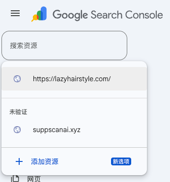
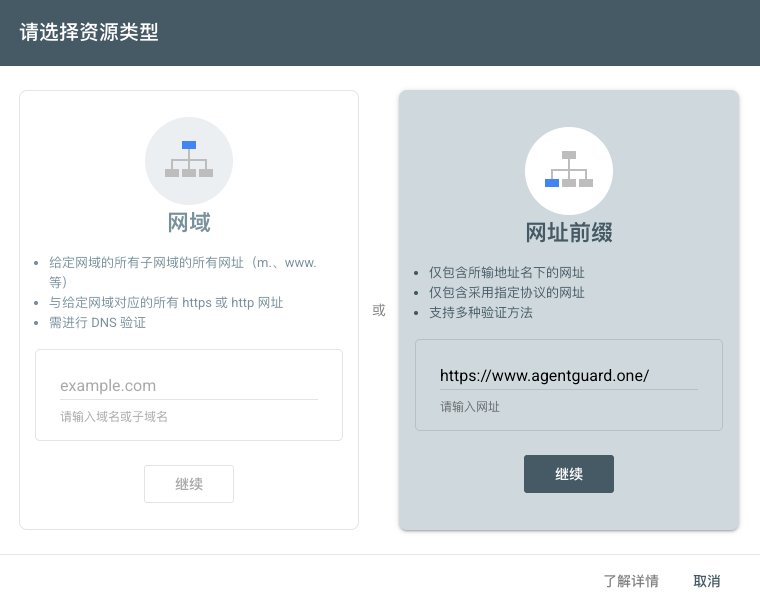

<!--
Source: https://acntglrfp7bm.feishu.cn/wiki/KTkQwziB2ii4uOkVOSRcwh4un9g
Feishu document id: FqXYdRy4NoVxOHxxBPxc9p2xnic
Revision: 121
Exported at: 2026-08-15T13:31:06Z
-->
# GSC接入指南

需要用新域名www.agentguard.one 新建Google Search Console项目，避免旧域名数据混淆，方便后续做分析。

访问https://search.google.com/search-console

### Step 1 添加资源

### Step 2 验证所有权

### Step 3 添加成员

设置 -> 用户和权限 -> 添加账户

需要添加的邮箱：

- fabry.coffee@gmail.com
- xinweiliao.work@gmail.com
- [asherpatel655@gmail.com](mailto:asherpatel655@gmail.com)